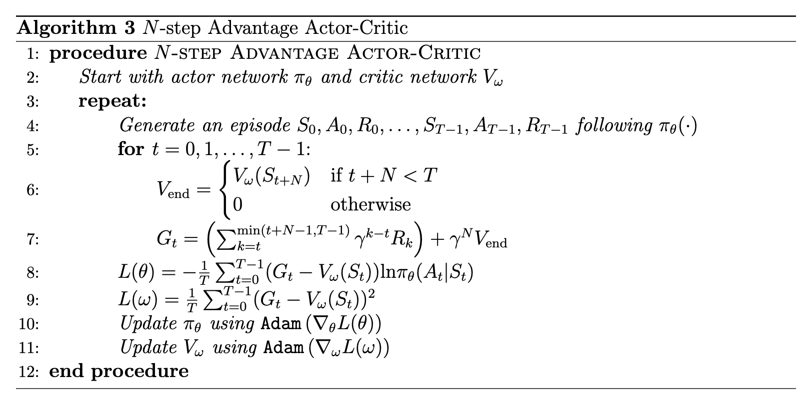

#### Actor-Critic Methods
- Combine policy gradient (**actor**) with value function approximation (**critic**).
- Actor: parameterized policy $\pi_\theta(a \mid s)$.
- Critic: estimates value function $V^\pi_w(s)$ or action-value $Q^\pi_w(s,a)$.
- **Update rules:**
    - Actor update:  
        $\theta \leftarrow \theta + \alpha \nabla_\theta \log \pi_\theta(a_t \mid s_t) \, A_t$
    - Critic update:  
        $w \leftarrow w - \beta \nabla_w \big(V_w(s_t) - (r_t + \gamma V_w(s_{t+1}))\big)^2$
- **Advantage function (reduces variance):**  
    $A^\pi(s,a) = Q^\pi(s,a) - V^\pi(s)$  
    Using $A^\pi$ instead of raw returns improves stability.
- **Q function:**
	- The **Q-function** (or Action-Value function), denoted as $Q(s, a)$, estimates the total expected future reward an agent will receive if it starts in a specific state `$s$`, takes a specific action $a$, and then follows its policy forever after
- Examples: **A2C, A3C, PPO, DDPG, SAC.**
#### Here’s the intuition:
1. **The Problem with Basic Policy Gradients**: Simple policy gradient methods (like REINFORCE) update the policy based on the total reward of an entire episode. This signal is very noisy; a single lucky action can appear good even if the overall policy is bad, and vice-versa.
2. **The Critic's Role**: To fix this, Actor-Critic methods introduce a **Critic**. The Critic's job is to provide a more stable, lower-variance evaluation of the Actor's actions.
3. **Using V-Values to Get the Advantage** (MC or TD): Instead of learning the value of every state-action pair (which can be inefficient), the A2C Critic learns the value of each **state ($V(s)$)**. It then uses this to calculate the **Advantage ($A(s, a)$)**:
		$A(s_t​,a_t​)≈(r_t​+γV(s_t+1​))−V(s_t​)$
    The Advantage doesn't just tell you if an action was good in an absolute sense; it tells you **how much better or worse it was than the average action** from that state. This is a much more powerful and stable learning signal.
    - If $A > 0$, the action was better than expected. The Actor should increase its probability.
    - If $A < 0$, the action was worse than expected. The Actor should decrease its probability.
- **A2C’s Use of Q-function**
	- A2C doesn’t explicitly learn the full **Q-function**.
	- Instead, it learns **state-value function $V^\pi(s)$** (via the critic network).
	- The **Q-function is implicitly used** in defining the advantage:
	    - When estimating $A(s,a)$, A2C approximates:
	        $A(s_t,a_t) \approx \big(r_t + \gamma V(s_{t+1})\big) - V(s_t)$
	    - Here, $r_t + \gamma V(s_{t+1})$ is essentially a **one-step sample-based estimate of $Q(s_t,a_t)$**.
#### How does N-Step help:
While using a critic helps, there's still a trade-off between bias and variance in how you estimate the advantage.
- **1-Step Return (Low Variance, High Bias)**: A basic Actor-Critic uses a 1-step lookahead: $A(s_t, a_t) \approx (r_t + \gamma V(s_{t+1})) - V(s_t)$. This has low variance because it depends on only one real reward, but it has high bias because it relies heavily on the potentially inaccurate estimate from the critic ($V(s_{t+1})$).
- **Monte Carlo Return (High Variance, Low Bias)**: REINFORCE uses the full return. This is an unbiased estimate of the true return, but it has very high variance.
**N-step returns** provide a compromise between these two extremes. The N-step return is calculated by summing the next `$N$` real rewards and then "bootstrapping" (using the estimated value) from the state you land in after $N$ steps: $G_{t:t+N​}=r_t​+γr_{t+1​}+⋯+γ^{N−1}r_{t+N−1}​+γ^N V(s_{t+N​})$
Using this N-step return to calculate the advantage helps in two ways:
1. **It reduces bias** compared to a 1-step return because it incorporates more real, unbiased reward information before relying on the critic's estimate.
2. **It reduces variance** compared to a full Monte Carlo return because the sequence of random variables is much shorter (`$N$` steps vs. the rest of the episode).

Improve diversity of updates:
[[A3C]]