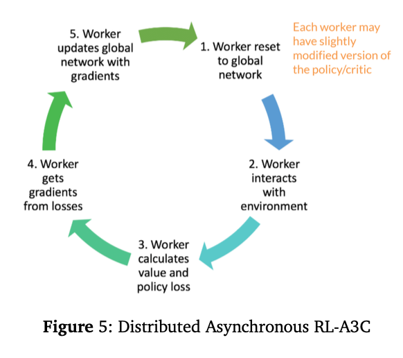

### A2C (synchronous).
Multiple environments roll out for T steps, compute gradients, _aggregate synchronously_, then update the global network and broadcast parameters.
### A3C (asynchronous).
Workers maintain local copies, interact with different parts of the environment, compute gradients, and _update the global network asynchronously_ (no locks across workers). This decorrelates data and stabilizes on-policy learning without a replay buffer.
The core idea of A3C is to have multiple "worker" agents interacting with their own copies of the environment simultaneously. These workers update a single "global" network.
- **Global Network**: There is one central network, often called the "target" or "global" network, which contains the master parameters for both the policy (Actor) and the value function (Critic).
- **Worker Agents**: Multiple worker agents are created, each with its own set of network parameters and its own copy of the environment. These workers run in parallel on different CPU threads.
- **Asynchronous Learning Loop**: Each worker follows this process independently:
    - It copies the latest parameters from the global network.
    - It interacts with its environment for a small number of steps (e.g., 5 steps), collecting experiences (states, actions, rewards).
    - It calculates the gradients for both its Actor and Critic networks based on these experiences.
    - It sends these gradients up to the global network.
    - The global network updates its parameters using the gradients from that worker. The worker then repeats the process.
#### Problem:
- The problem with that is the experience is very correlated and sequential which can cause instability when training the neural network. We want to diversify the experience and de-correlated the gradient updates. In other words, we want to parallelize the collection of experiences and stabilize training with multiple threads of experiences and different exploration strategies. --> Asynchronous Deep RL
- Distributed RL
	- Distributed Synchronous RL-A2C: All agents have identical policies. Each one collect experiences, compute gradients, aggregate all of them to update the policy, and reshare.
	- Distributed Asynchronous RL-A3C: Agents can have slightly different policies where each worker updates the global network, one at a time.

### Why Use A3C? Solving Key Problems in RL

A3C was designed to address two major challenges faced by earlier algorithms like DQN:
1. It Solves the Correlated Data Problem
Standard online RL algorithms learn from consecutive samples, which are highly correlated. A sequence of states in a game are not independent of each other. This correlation can make learning unstable.
- **DQN's Solution**: Use a large **experience replay buffer**. By storing hundreds of thousands of past experiences and sampling them randomly, DQN breaks the temporal correlations in the data. The downside is that this requires a massive amount of memory.
- **A3C's Solution**: Use **asynchronous parallel workers**. Each worker has a different experience in its own environment. Because the global network receives updates from all these different workers at different times, the updates are naturally decorrelated. This achieves the same stabilizing effect as an experience replay buffer without the high memory cost.
2. It's More Sample Efficient
	By using multiple parallel workers, A3C can explore a much larger part of the state space in the same amount of time compared to a single-agent algorithm. This parallelization dramatically speeds up the training process. The algorithm is also designed to run efficiently on standard multi-core CPUs without requiring expensive GPUs, making it more accessible.
	In summary, A3C's key innovation is using **asynchrony** to replace the need for an experience replay buffer, leading to a more memory-efficient and often faster training algorithm.