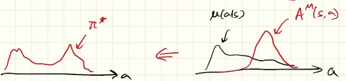

Approximation trick (sample state from $\mu$, actions from $\pi$): 
Scribe page 5-8

#### 1. **AWR Objective**
$\max_{\pi} \; \mathbb{E}_{s \sim d^\mu(s)} \Big[ \mathbb{E}_{a \sim \pi(\cdot|s)} \big[ A^\mu(s,a) \big] - \alpha D_{KL}(\pi \,\|\, \mu) \Big]$
where:
- $\pi$ = new policy we want to learn.
- $\mu$ = behavior policy (the replay buffer distribution that generated the data).
- $d^\mu(s)$ = discounted state distribution under μ.
- $A^\mu(s,a)$ = **advantage function** under the behavior policy.
- $D_{KL}(\pi \,\|\, \mu)$ = KL divergence between new policy $\pi$ and behavior policy $\mu$.
- $\alpha$ = regularization weight.
#### 2. **What is Being Estimated (and Why)?**
1. **Value Function $V^\mu(s)$:**
    - Needed to compute the advantage.
    - Estimated by regression to empirical returns (TD or Monte Carlo).
2. **Advantage Function $A^\mu(s,a)$:**
    - Estimated as: $A^\mu(s,a) = Q^\mu(s,a) - V^\mu(s)$
    - In practice approximated by: $A^\mu(s,a) \approx \Big(\sum_{t=0}^k \gamma^t r_t\Big) + \gamma^k V^\mu(s_k) - V^\mu(s)$
    - Intuition: measures how much better an action a is compared to the baseline behavior $\mu$.
3. **Policy Update $\pi$:**
    - Instead of gradients, AWR updates $\pi$ by **regression toward actions in replay buffer**, but weighted by $\exp(\tfrac{1}{\beta} A^\mu(s,a))$.
    - This comes from the KL-regularized objective in the formula.
4. $d^\pi(s)$ is estimated by $d^\mu(s)$ as long as $\pi$ and $\mu$ are close
#### 3. **Why AWR? (Intuitions)**
- The core idea:
    $\pi(a|s) \propto \mu(a|s) \exp\!\Big(\tfrac{1}{\beta} A^\mu(s,a)\Big)$
    - If $A^\mu(s,a)$ is **large positive** → increase probability of that action.
    - If $A^\mu(s,a)$ is **negative** → downweight that action.
    - The KL penalty keeps $\pi$ from drifting too far away from $\mu$ (ensures stability).
- **Why it works:**    
    - Turns policy improvement into a **weighted supervised learning problem**: imitate good actions more strongly than bad ones.
    - No high-variance importance sampling (unlike naive off-policy policy gradient).
    - More stable than directly estimating Q-values for actor updates.
#### 4. **Advantages of AWR**
- **Off-policy friendly:** Can reuse replay buffer data.
- **Stable:** KL regularization avoids catastrophic policy updates.
- **Simple:** Policy update reduces to weighted maximum likelihood regression.
- **Low variance:** Avoids noisy gradient estimates.
#### 5. **Limitations**
- Relies on accurate **advantage estimates** (bias here directly impacts learning).
- Needs careful tuning of temperature parameter $\beta$.
- May be less aggressive in exploration compared to entropy-regularized algorithms like **SAC**.

✅ In short: AWR says — _take your replay buffer ($\mu$), estimate which actions were good ($A^\mu$), and regress your policy $\pi$ toward those actions, but weight them exponentially by their advantage_.