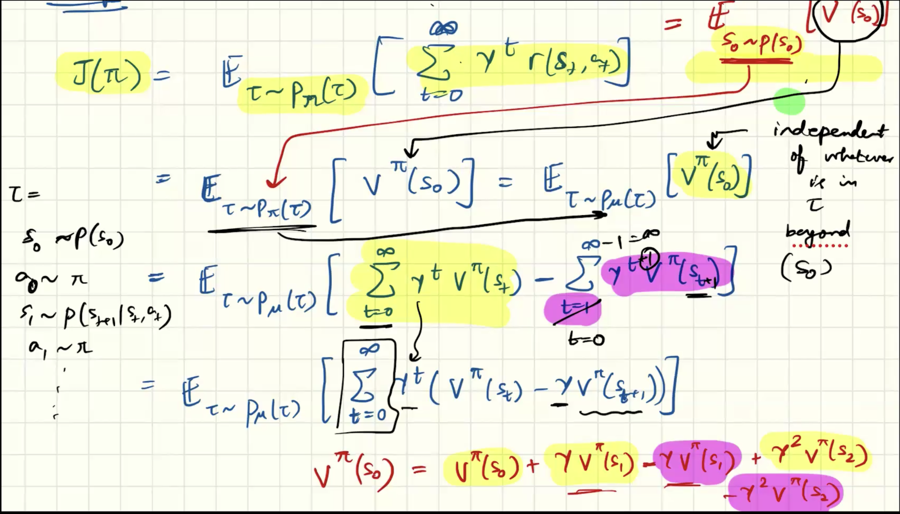
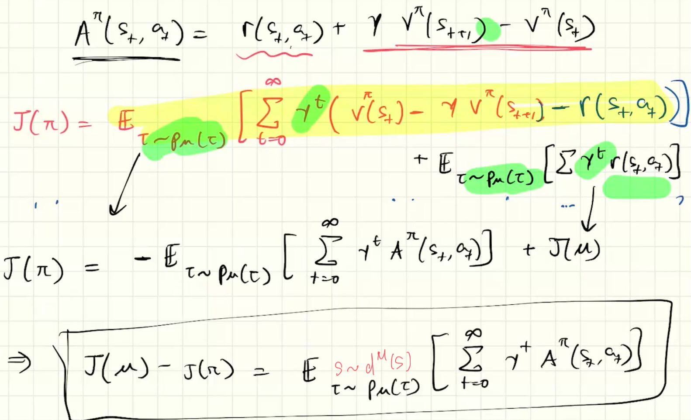

## Performance Difference Lemma
#### 1. **Definition (Performance Difference Lemma)**
The main motivation of this lecture is to find an algorithm which merges the best attributes of the Actor-Critic and Q-value algorithms. The main advantage of the actor critic algorithm is a probability distribution over actions, while the main benefit of Q-Learning style approaches is their off-policy nature (no need to have an online sampling algorithm). Ideally, we would want to sample rollouts of an old policy 𝜇and update 𝜋, our optimal policy. The Performance Difference Lemma gives an, albeit incomplete, method to provide such a framework.

For two policies $\pi$ and $\mu$, the lemma states:
$J(\pi) - J(\mu) = \mathbb{E}_{\tau \sim P_\pi(\tau)}\left[ \sum_{t=0}^{\infty} \gamma^t A^{\mu}(s_t, a_t) \right] \\ = \frac{1}{1-\gamma} \mathbb{E}_{s \sim d^\pi(s), a \sim \pi(\cdot|s)}[A^\mu(s, a)]$
where:
- $J(\pi) = \mathbb{E}_{\tau \sim P_\pi} \left[ \sum_{t=0}^\infty \gamma^t r(s_t, a_t) \right]$ is the expected discounted return under policy $\pi$.    
- $\tau = (s_0, a_0, s_1, a_1, \ldots)$ is a trajectory generated by policy $\pi$.
- $A^\mu(s,a) = Q^\mu(s,a) - V^\mu(s)$ is the **advantage function** under the baseline policy $\mu$.
- $\gamma \in [0,1)$ is the discount factor.
#### 2. **Motivation**
Why do we need this?
- In policy optimization, we want to know: _How much better is a new policy $\pi$ than some baseline policy $\mu$?_
- Directly comparing $J(\pi)$ and $J(\mu)$ by rollouts is expensive.
- PDL gives a way to **express performance difference using only the advantage of the baseline policy $\mu$** and the distribution of states and actions visited by the new policy $\pi$.
- This is the key theoretical result underlying **policy gradient theorems** and **trust-region policy optimization (TRPO, PPO, etc.)**.
#### 3. **Intuition**
- $A^\mu(s,a)$ tells us whether action aa is **better or worse than average** under policy $\mu$.
- If $\pi$ tends to choose actions with **positive advantage under $\mu$**, then $J(\pi) > J(\mu)$.
- If $\pi$ picks actions with **negative advantage**, then $J(\pi) < J(\mu)$.
- The expectation is taken over trajectories from $\pi$, because we care about how often the new policy visits different states.
👉 So: the performance difference equals the **discounted sum of advantages of the baseline policy**, weighted by how the new policy $\pi$ explores the environment.
- We are essentially computing the gap between J(π) and J(μ), but instead of just computing rewards and taking the difference, we are going to states where π goes, and summing over the advantage that the actions proposed by π have over what μ would have done.
- True fact for two policies. 
#### 4. **Proof Sketch**
Start from the definition of returns. $J(\pi) = \mathbb{E}_{\tau \sim P_\pi} \left[ \sum_{t=0}^\infty \gamma^t r(s_t, a_t) \right]$
Now insert the baseline value function $V^\mu$: $r(s_t, a_t) = A^\mu(s_t, a_t) + V^\mu(s_t) - \gamma V^\mu(s_{t+1})$
(since $Q^\mu(s_t, a_t) = r(s_t,a_t) + \gamma \mathbb{E}[V^\mu(s_{t+1})]$ and $A^\mu = Q^\mu - V^\mu$).
Substitute back: $J(\pi) = \mathbb{E}_{\tau \sim P_\pi} \left[ \sum_{t=0}^\infty \gamma^t \big( A^\mu(s_t, a_t) + V^\mu(s_t) - \gamma V^\mu(s_{t+1}) \big) \right]$
The telescoping terms with $V^\mu$ collapse, leaving: $J(\pi) = J(\mu) + \mathbb{E}_{\tau \sim P_\pi} \left[ \sum_{t=0}^\infty \gamma^t A^\mu(s_t, a_t) \right]$
which is exactly the statement of the lemma. 

#### 5. **Key Takeaways**
- **Formal statement:** $J(\pi) - J(\mu) = \mathbb{E}_{\tau \sim P_\pi(\tau)} \Big[ \sum_{t=0}^\infty \gamma^t A^\mu(s_t, a_t) \Big]$
- $A^\mu(s_t, a_t)$ estimated via a critic
- **Motivation:** Lets us evaluate the improvement of a new policy using the advantage of an old one.
- **Intuition:** If $\pi$ consistently picks actions that look better under μ\mu, then it will outperform $\mu$.
- **Proof:** Derived via decomposition of rewards and telescoping cancellation.
✅ In short: the **Performance Difference Lemma** is the theoretical foundation that allows safe and principled policy improvement in RL.
## [[Importance sampling]]
Practical offline gradient descent algorithm
[[Algorithm Approach]]
#### **Option 1: Use states from μ, but estimate \($A^\pi$\).**
- $J_{\pi} - J_{\mu} = \mathbb{E}_{s \sim d^{\mu},\, a \sim \pi} \left[ A^{\pi}(s, a) \right]$
- Here, expectations are under \($d^\mu$\), the state distribution of the data collection policy.
- Requires estimating \($A^\pi$\) (the advantage of the current learning policy)
- This is challenging, but connects to *off-policy TD learning methods*, such as Soft Actor-Critic ([[SAC]]) and [[TD3]], [[Offline Actor Critic]].
- These algorithms train a critic to approximate \($Q^\pi$\), from which \($A^\pi$\) can be derived.
#### **Option 2: Use states from π, but estimate \($A^\mu$\).**
- $J_{\pi} - J_{\mu} = \mathbb{E}_{s \sim d^{\pi},\, a \sim \pi} \left[ A^{\mu}(s, a) \right]$
- Here, expectations are under \($d^\pi$\), but we only need \($A^\mu$\), which is easier to estimate from replay buffers or Monte Carlo rollouts of μ.
- This connects to algorithms like Proximal Policy Optimization ([[PPO]]) and Advantage-Weighted Regression ([[AWR]]).
- In practice, algorithms often approximate \($d^\pi$\) with data collected from something “close” to π.

Approximation trick (sample state from $\mu$, actions from $\pi$): 
Scribe 7a7b page 5-8
