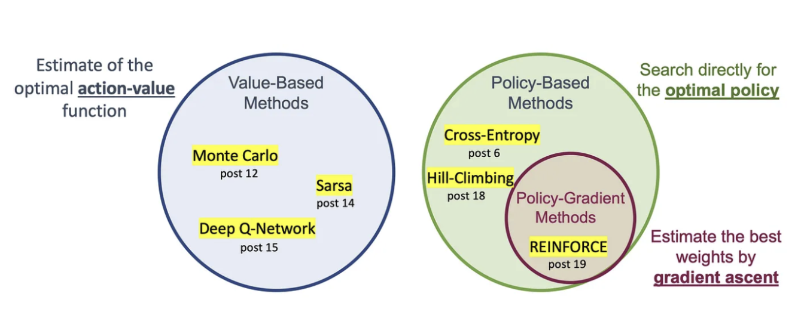

**On-Policy vs Off-Policy Workflow**
```
 On-Policy:             Off-Policy:
 πθ (collects data) →   μ (behavior policy collects data)
 Update θ using πθ       Store in replay buffer
 Discard old data        Sample minibatches, update πθ
```
On-policy requires **new rollouts every update**; off-policy can **reuse old transitions many times**, making it more sample-efficient but requiring corrections to avoid bias.
### 1. **Setup: Sampling from $\mu$ vs. $\pi$**
- **$\pi$ = new (target) policy** we are training/evaluating.
- $\mu$ = **behavior policy** that actually generated the data.
So when we talk about sampling:
- From $\pi$: Roll out the _current_ policy we want to optimize.
- **From $\mu$:** Reuse data from some _other_ policy (could be older versions of **$\pi$, or even a completely different policy, like a replay buffer).
### 2. Why the Difference Matters
- The **Performance Difference Lemma** says: $J(\pi) - J(\mu) = \mathbb{E}_{\tau \sim P_\pi} \Big[ \sum_t \gamma^t A^\mu(s_t,a_t) \Big]$
    This expectation is over **$\pi$’s distribution**, not $\mu$.
- But in practice, it’s often easier to get samples from $\mu$ (stored rollouts, replay buffer).
- So algorithms differ in **how they bridge the gap** between $\mu$-samples and the desired $\pi$-expectations.
### 3. **Algorithms**
##### **(a) [[PPO]] (Proximal Policy Optimization)**
- **Sampling:** On-policy → rollouts are generated by the _current policy_ (or a very recent version of it).
- **Why:** Ensures that the data distribution matches **$\pi$, so policy gradient estimates are unbiased.
- **Trick:** Uses clipping/KL constraints to avoid **$\pi$ drifting too far from the old policy within one update.
- **Intuition:** “Trust region” update — only change **$\pi$ where you know you have reliable samples.
- **Pros:** Stable, theoretically grounded.
- **Cons:** Very sample-inefficient (must discard data after one or two updates).
##### **(b) [[AWR]] (Advantage Weighted Regression)**
- **Sampling:** Off-policy → can reuse data from replay buffer (**$\mu$).
- **How:** Uses importance weighting to correct for the mismatch: $\pi(a|s) \propto \mu(a|s) \exp\!\Big(\tfrac{1}{\beta} A^\mu(s,a)\Big)$
- **Why:** Turns off-policy samples into supervised regression targets, weighted by advantage.
- **Intuition:** “Imitate good actions more than bad ones” (soft policy improvement).
- **Pros:** Can reuse lots of past data, more sample-efficient than PPO.
- **Cons:** Still biased if the replay buffer is too different from current policy (distribution shift).
##### **(c) [[SAC]] (Soft Actor-Critic)**
- **Sampling:** Off-policy → samples from replay buffer (**$\mu$).
- **How:** Uses importance weighting _implicitly_ by learning Q-functions. The replay buffer ensures good coverage of states.
- **Why:** Maximizes entropy-regularized return: $J(\pi) = \mathbb{E}_{s \sim \mu, a \sim \pi} [Q^\pi(s,a) - \alpha \log \pi(a|s)]$
- **Intuition:** The replay buffer acts as an approximate state distribution. The entropy bonus keeps exploration broad.
- **Pros:** Very sample-efficient, stable for continuous control.
- **Cons:** Still sensitive to replay buffer distribution mismatch, requires careful hyperparameter tuning.
##### **(d) TD3 (Twin Delayed DDPG)**
- **Sampling:** Off-policy → samples from replay buffer (**$\mu$).
- **How:** Learns Q-functions using replay data, trains deterministic policy to maximize Q.
- **Tricks:**
    - “Twin critics” to reduce Q overestimation bias.
    - Target policy smoothing (adds noise to target actions).
- **Intuition:** Reuse experience many times, rely on critic to guide deterministic actor.
- **Pros:** Very sample-efficient. Strong performance in continuous control.
- **Cons:** Deterministic policy → exploration is harder; sensitive to replay buffer quality.
### 4. **Intuition: Sampling Trade-offs**
- **Sampling from $\pi$ (on-policy):**
    - Matches the desired distribution exactly.
    - Low bias, but very high variance.
    - Data inefficient — can’t reuse past trajectories.
    - Used in **PPO, A2C, A3C**.
- **Sampling from $\mu$(off-policy):**
    - Enables replay buffers → much higher sample efficiency.
    - Needs correction (importance weighting, critics).
    - Introduces potential bias if $\mu$ is very different from **$\pi$.
    - Used in **SAC, TD3, AWR, DDPG**.
### 5. **Summary Table**

| Algorithm | Sampling From                     | Correction Method                   | Pros                     | Cons                                       |
| --------- | --------------------------------- | ----------------------------------- | ------------------------ | ------------------------------------------ |
| **PPO**   | $\pi$(on-policy)                  | Clipping/KL trust region            | Stable, low bias         | Sample inefficient                         |
| **AWR**   | $\mu$ (off-policy)                | Advantage-weighted regression       | Reuses data, simple      | Biased if  $\mu\not\approx \pi$            |
| **SAC**   | $\mu$ (off-policy, replay buffer) | Q-learning + entropy regularization | Sample efficient, robust | Hyperparameter sensitive                   |
| **TD3**   | $\mu$ (off-policy, replay buffer) | Twin critics, smoothing             | Strong performance       | Exploration harder, buffer quality matters |
✅ **Key takeaway:**
- On-policy (sample from $\pi$): unbiased, stable, but data-hungry.
- Off-policy (sample from $\mu$): efficient, but needs correction for distribution shift.
- Algorithms choose one depending on whether stability or efficiency is more critical.

**Value-based methods (e.g. Q-learning) struggle with:**
- Large/continuous action spaces
- Instability in function approximation  
**Policy Gradients offer:**
- Direct optimization of the policy. 
- Can learn stochastic Policies
- Naturally handle continuous actions (think how?)
**Problems:**
- High-variance (e.g. REINFORCE)
- Sample Efficiency (on-policy constraints)