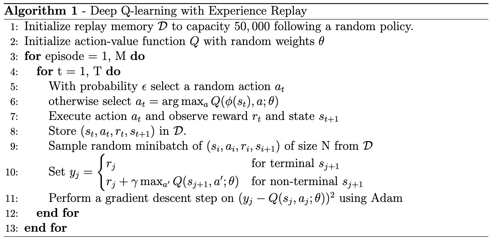
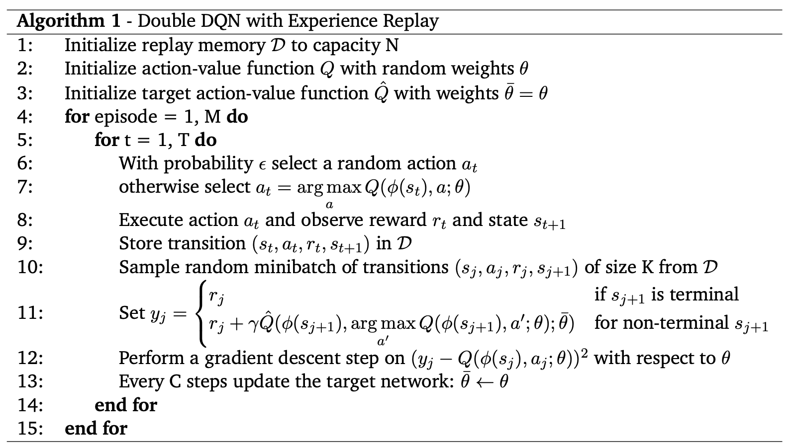
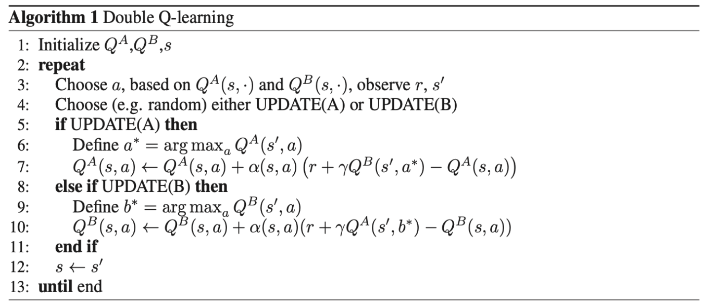
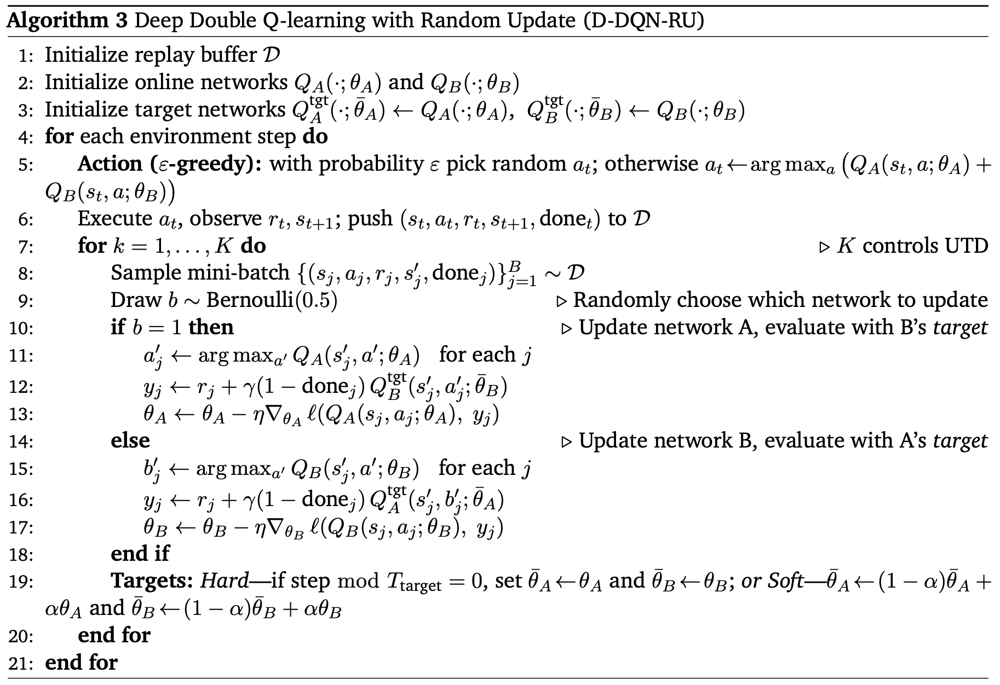

DQNs are a variant of fitted Q-iteration that use gradient-based updates for the parameters of the value function.

To solve the problem of highly correlated updates in on-policy training, two mechanisms are introduced:
1. **Replay buffer**: Stores experience tuples (s,a,r,s′). Updates to $Q_{θ_t​​}$ are made using i.i.d. samples from this buffer, which is populated by trajectories of the current policy πt​.
2. **Target network**: A separate network with parameters θˉ is used to compute the target y(s,a). Its parameters are updated only periodically to stabilize training.
There are two ways of updating targets:
3. **Soft targets**: Update rule defined by $min θ_t​​(Q_{θ_t​​}(s,a)−y_{θ_{t−1}}​​(s,a))^2$. Here, the target y is computed using parameters from the previous step, $θ_{t−1}$​. This results in more frequent but smaller updates, reducing instability while still keeping the target network close to the online network. $\bar{\theta}_{i+1} \leftarrow \alpha\theta_{i+1} + (1-\alpha)\bar{\theta}_i$ , $\alpha$ very small, 0.005
4. **Hard targets**: The target network parameters θˉ are held fixed for K gradient steps on the TD-error, then set equal to the current network parameters θt​. Small K (e.g., K=1) can lead to instabilities due to strong correlations between the target and the Q-function.
 5. **Comparison**

| Aspect          | **Hard Target Update**     | **Soft Target Update**                        |
| --------------- | -------------------------- | --------------------------------------------- |
| Update Rule     | Copy every C steps         | Polyak average with rate $\tau$               |
| Target Change   | Abrupt, discontinuous      | Smooth, continuous                            |
| Stability       | Can oscillate near updates | More stable                                   |
| Hyperparameters | Interval C                 | Smoothing factor $\tau$                       |
| Common Usage    | Original DQN, Atari        | DDPG, TD3, SAC, sometimes modern DQN variants |
. **When to Use Which**
- **Hard Target Updates**
    - If the environment is **discrete-action** and you follow the original DQN setup.
    - Simpler, fewer hyperparameters.
- **Soft Target Updates**
    - If environment is **continuous control** (common in robotics).
    - If training is unstable and you want smoother learning.
    - Preferred in most modern deep RL algorithms (except “classic” DQN).
### **Challenges with DQNs:**
1. **Sampling from replay buffers**: Ensuring that sampled batches are representative and uncorrelated is difficult. Poor sampling can introduce bias and slow convergence.
2. **Overestimation from noise and stochasticity**: Q-learning updates can systematically overestimate values, leading to instability. This issue is commonly referred to as the **overestimation problem**. Accidental errors may lead to divergence. The target network will amplify the error.
#### 1. **Q-learning Loss with MSE**
In DQN, the loss for Q-network parameters $\theta$ is usually:$L(\theta) = \mathbb{E}_{(s,a,r,s') \sim D} \Big[ \big( y - Q_\theta(s,a) \big)^2 \Big]$
where the target is: $y = r + \gamma \max_{a'} Q_{\theta^-}(s',a')$
This is a **mean squared error (MSE)** between the target y and the prediction $Q_\theta(s,a)$.
#### 2. **Huber Loss**
The **Huber loss** is a robust alternative to MSE.  
For an error term $\delta = y - Q_\theta(s,a)$:
$\ell_\kappa(\delta) = \begin{cases} \frac{1}{2}\delta^2 & \text{if } |\delta| \leq \kappa \\[6pt] \kappa \big(|\delta| - \tfrac{1}{2}\kappa \big) & \text{if } |\delta| > \kappa \end{cases}$
- Quadratic when the error is **small** ($|\delta| \leq \kappa$).
- Linear when the error is **large** ($|\delta| > \kappa$).
- $\kappa$ is a threshold parameter (in DQN, usually set to 1).
So the **Huber loss for Q-learning** is:
$L(\theta) = \mathbb{E}_{(s,a,r,s') \sim D} \big[ \ell_\kappa\big( y - Q_\theta(s,a)\big) \big]$
#### 3. **Why Huber Loss Improves Stability**
- **MSE Problem:**
    - Squared error grows rapidly with large TD errors.
    - In Q-learning, targets y can be very noisy (due to bootstrapping + stochastic environment).
    - Large errors → huge gradients → unstable updates.
- **Huber Loss Solution:**
    - Behaves like MSE when errors are small → precise fitting around the optimum.
    - Behaves like MAE (mean absolute error) when errors are large → avoids exploding gradients.
    - Provides a balance: sensitive near the target, robust to outliers.
- **Effect in practice:**
    - Reduces sensitivity to rare, catastrophic TD errors (from bad targets).
    - Leads to smoother training curves and less divergence.
    - Was a key modification in the original DQN paper (Nature 2015).
- **Why it helps:**
    - Limits gradient explosion from large TD errors.
    - Makes learning more stable.
    - Balances accuracy (MSE) with robustness (MAE).
👉 In short: The **Huber loss stabilizes DQN** by making updates robust to noisy or outlier TD errors, while still being accurate for small errors.
### Practical details for Q-learning:
- coverage
- high URD can destabilize training
- improved loss functions: 
	- Hubert loss: 
	- $\ell_\delta(e) =\begin{cases}\frac{1}{2} e^2 & \text{if } |e| \leq \delta, \delta \left( |e| - \frac{1}{2} \delta \right) & \text{otherwise.}\end{cases}$
## Double DQN
$y_t = r_{t+1} + \gamma Q_{\text{target}}(s_{t+1}, \arg \max_a Q_\omega(s_{t+1}, a))$

### How Double DQN Leverages the Delay: Reducing Overestimation Bias

The specific innovation of **Double DQN** is to address a different problem: **maximization bias**.

- **The Problem**: In the standard DQN target calculation, $\text{target} = r + \gamma \max_{a'} Q_{\text{target}}(s', a')$, the `max` operator tends to pick actions whose values are overestimated due to noise. This leads to a consistent upward bias in the value estimates, which can slow down learning and lead to suboptimal policies.
    
- **The Solution**: Double DQN cleverly uses the two available networks (main and target) to decouple **action selection** from **action evaluation**.
    
    Here's how the target is calculated in Double DQN:
    1. **Action Selection**: First, use the **main network** to ask, "What is the best action to take in the next state $s$?" $a∗=arga′max​Qmain​(s′,a′)$
    2. **Action Evaluation**: Then, use the **target network** to ask, "What is the value of that _specific action_, $a∗$?" $target=r+γQtarget​(s′,a∗)$
        
By using the main network to choose the action and the delayed target network to evaluate it, Double DQN reduces the tendency to select and lock onto overestimated values.

In summary, the **delay itself is for stability**, and Double DQN **leverages the existence of that delayed network** to implement its clever decoupling mechanism, which in turn **reduces overestimation bias**.
### Overestimation Bias
-  UTD update to data Ratio: high UTD amplifies the compounding errors
- target overestimate due to max operator selecting positively noisy actions and compounding through bootstrapping

## ChatGPT Summary
#### 1. **The Overestimation Problem in DQN**
In Q-learning (and DQN), the update target is: $y = r + \gamma \max_{a'} Q_{\theta^-}(s', a')$
- The $\max$ operator **both selects and evaluates** the next action.
- If Q-values are noisy (due to limited data, stochasticity, or approximation errors), the $\max$ will tend to **overestimate** the true expected return.
- This bias accumulates → unstable learning and overly optimistic Q-values.
🔑 Intuition:  
It’s like always assuming the best-case action outcome, even if it’s just noise.
#### 2. **Mitigation Techniques**
##### **(a) Double Q-Learning**
- **Idea:** Decouple **action selection** from **action evaluation**.
- Maintain **two Q-functions**, $Q^A$ and $Q^B$.
- Update one using the other’s estimate: $y = r + \gamma Q^B(s', \arg\max_{a'} Q^A(s',a'))$
    - $Q^A$ chooses the action.
    - $Q^B$ evaluates it.
- Reduces upward bias because action selection noise isn’t reinforced by the same network
##### **(b) Deep Double Q-Learning (DDQN)**
- Adaptation of Double Q-Learning for DQNs.
- Uses **online network** for action selection, **target network** for evaluation: $y = r + \gamma Q_{\theta^-}(s', \arg\max_{a'} Q_\theta(s',a'))$
- Much more stable than vanilla DQN.
- Common default in modern implementations.
##### **(c) Deep Double Q-Learning with Random Updates (Ensembles)**

- **Idea:** Maintain an ensemble of Q-networks.
- Randomly select which Q-network(s) to update each step.
- This stochasticity helps decorrelate errors across networks.
- Similar spirit to “bootstrapped DQN” or “randomized value functions” — used for both exploration and reducing bias.
### **(d) N-Step Returns**

- Instead of one-step targets, use **multi-step returns**:   $y_t^{(n)} = \sum_{k=0}^{n-1} \gamma^k r_{t+k} + \gamma^n Q_{\theta^-}(s_{t+n}, a_{t+n})$
- Benefits:
    - Reduces variance in target estimation.
    - Propagates reward signals faster.
    - Mitigates overestimation because the target relies less on a single max operator.
- Widely used in Rainbow DQN (which combines DDQN + prioritized replay + multi-step returns + dueling).
#### 3. **Comparison**

| Method                            | Fixes Overestimation? | How It Helps                                     |
| --------------------------------- | --------------------- | ------------------------------------------------ |
| **Double Q-Learning**             | ✅ Yes                 | Decouples selection and evaluation               |
| **Deep Double Q-Learning (DDQN)** | ✅ Yes                 | Online net selects, target net evaluates         |
| **Random Updates / Ensembles**    | ✅ Partially           | Averaging across multiple learners reduces noise |
| **N-Step Returns**                | ✅ Indirectly          | Smoother targets, less reliance on max operator  |
#### 4. **Summary**
- **Problem:** Vanilla DQN overestimates Q-values because $\max$ picks noisy high estimates.
- **Solutions:**
    - **Double Q-learning**: two networks for decoupled selection/evaluation.        
    - **Deep Double Q-learning (DDQN)**: practical neural version using online vs. target net.
    - **Randomized / ensemble updates**: reduce bias by decorrelating errors.
    - **N-step returns**: smooth out learning targets, reduce single-step max reliance.    
✅ In practice:
- **DDQN** is the default fix.
- **N-step returns + DDQN** (as in Rainbow DQN) → strong performance.
- Ensembles/randomized updates are useful but more computationally costly.

