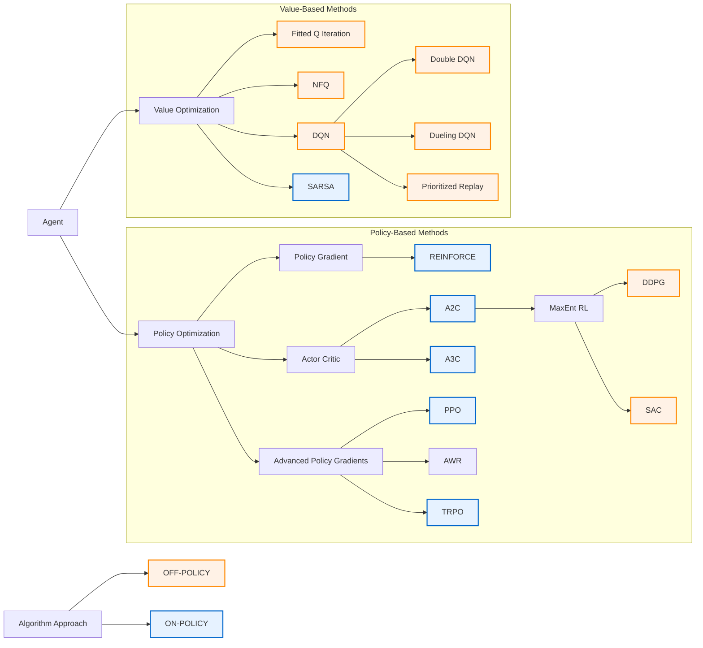

```mermaid
graph LR
    %% Define Styles
    classDef on_policy fill:#e6f2ff,stroke:#0066cc,stroke-width:2px;
    classDef off_policy fill:#fff2e6,stroke:#ff8800,stroke-width:2px;

    subgraph Value-Based Methods
        B[Value Optimization]
        B --> J[Fitted Q Iteration]
        B --> NFQ
        B --> DQN
        B --> SARSA
		D[Double DQN]
		E[Dueling DQN]
		F[Prioritized Replay]
		DQN --> D
		DQN --> E
		DQN --> F
    end
    
    subgraph Policy-Based Methods
        C[Policy Optimization]
        G[Policy Gradient]
        H[Actor Critic]
        
        C --> G
        C --> H
        C --> K[Advanced Policy Gradients]
		K --> PPO
		K --> AWR
        K --> TRPO
        
        G --> REINFORCE

        H --> A2C
        H --> A3C
        
        A2C --> L[MaxEnt RL]
        L --> DDPG
        L --> SAC
        
    end

    A[Agent]
    A --> B
    A --> C

	I[Algorithm Approach]
    I --> OFF-POLICY
	I --> ON-POLICY

    %% Apply On-Policy Styles
    class SARSA,REINFORCE,A2C,A3C,TRPO,PPO,ON-POLICY on_policy;

    %% Apply Off-Policy Styles
    class NFQ,DQN,DDPG,SAC,OFF-POLICY,J,D,E,F off_policy;
    
    %% Internal links
    class REINFORCE,REINFORCE_with_Baseline,A2C,I,DQN,B,J,K,PPO,L,DDPG,SAC,A3C,AWR internal-link
```

