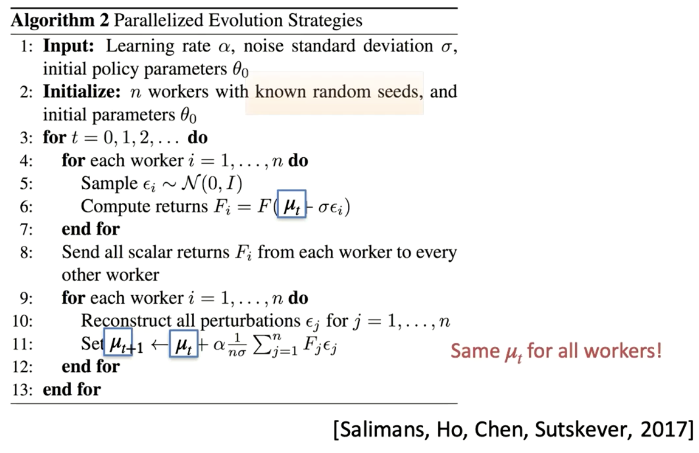

Evolutionary methods are a class of "black-box" optimization algorithms that use principles inspired by biological evolution—like reproduction, mutation, and selection—to find optimal solutions for complex problems. In reinforcement learning, they are used to directly search for the best policy parameters without needing to calculate gradients.

You'd typically use these techniques when the reward signal is sparse or deceptive, when the environment is not differentiable, or when you need to explore a wide range of policies to avoid getting stuck in a local optimum. They are particularly good for continuous control problems in robotics.
### General algorithm:
1. Initialize a population of parameter vectors (genotypes).
2. Apply random perturbations (mutations) to each parameter vector.
3. Evaluate the perturbed parameter vectors according to a fitness function.
4. Retain the perturbed vectors if they yield improved performance (selection).
5. Repeat from step 2.

Unlike policy gradient methods, **evolutionary methods** don't rely on **gradient information**. Instead, they explore the parameter space using **random mutations** and **selection**. This makes them a good choice for problems where gradients are unavailable, unreliable, or hard to compute.
### Cross entropy method
The first evolutionary strategy we consider is the **Cross-Entropy Method (CEM)**. In this approach, policy parameters are sampled from a **multivariate Gaussian distribution with a diagonal covariance matrix**. The mean and variance of the parameter distribution are updated towards the samples with the **highest fitness scores**.

Work embarrasingly well in low-dimensions
1. **Initialize**: Start with a probability distribution over the policy parameters (e.g., a Gaussian with mean $\mu$ and variance $\Sigma$).
2. **Sample**: Draw a population of `N` policy parameter vectors from this distribution.
3. **Evaluate**: Test each policy and calculate its fitness (total reward).
4. **Select Elites**: Identify the top `k` percent of policies (the "elites").
5. **Refit**: Calculate a new mean and variance based _only_ on the elite samples. This new, refined distribution is then used to generate the next population.
By repeatedly fitting the distribution to the best-performing samples, CEM quickly hones in on high-reward regions of the parameter space.

### Covariance Matrix Adaptation
The second evolutionary strategy discussed is the **Covariance Matrix Adaptation Evolution Strategy (CMA-ES)**. This method samples policy parameters from a **multivariate Gaussian distribution** with a **full covariance matrix**, which distinguishes it from strategies that use different variances for each dimension. This full covariance matrix enables CMA-ES to capture **correlations between parameters**. The mean and covariance matrix are then iteratively updated based on the distribution of samples that achieved the highest fitness scores.
- sample
- select elites
- update mean
- update covariance
- iterate

CMA-ES is a more advanced evolutionary strategy that is particularly effective for complex, non-convex optimization problems. It's similar to CEM but with a crucial difference: it intelligently adapts the **covariance matrix** ($\Sigma$) of the search distribution.
Adapting the covariance matrix allows the search to:

- **Elongate or shrink** along different directions, enabling it to navigate narrow valleys or broad plains in the fitness landscape.
- **Rotate** its orientation to align with ridges in the landscape.

This makes CMA-ES much more efficient at finding optimal solutions when the parameters are correlated.

### Evolution for Action Selection
- Generate diverse candidate action trajectories, assess each by summing cumulative rewards, retain the highest-scoring trajectories, and apply iterative perturbations until a trajectory meeting predefined performance criteria is identified.
- Rather than optimizing policy parameters directly, perform **model-based trajectory optimization** by searching in the action space to maximize total reward or reach a target optimal state.
- A **zero-order method** that does not compute the gradient. Just perturbing and computing fitness scores and weighted average of them based on the scores.
### Natural Evolutionary Strategies (NES)

NES bridges the gap between evolutionary methods and gradient-based methods. Instead of using a simple gradient, NES uses the **natural gradient**.

The key idea is to find the direction in the _distribution space_ that maximally increases the expected fitness. It treats the search distribution itself as the object to be optimized and updates its parameters (e.g., the mean and covariance of a Gaussian) to produce better samples. It effectively computes a "gradient" for the entire population, making it a more principled and often more efficient search strategy than simpler methods.

How to sample from gaussian distribution: $z \sim \mathcal{N}(\mu, \Sigma)$
$z = \mu + \Sigma^{\frac{1}{2}}\epsilon \text{ where } \epsilon \sim \mathcal{N}(0, I)$
### Distributed Evolution
Communications between GPUs becomes bottleneck. Sending vectors to each worker is very expensive.

Instead, send random seeds to workers and sample locally.

Despite these advantages, ES can still get stuck in local optima. A simple strategy to improve robustness is to evaluate candidate policies across multiple related tasks or environments. This forces exploration to generalize beyond a single setting, reducing the chance of converging prematurely. While there are no formal guarantees, empirical studies show this approach helps ES escape poor local solutions and improves overall performance.

---
# ChatGPT summary
# 1. **Evolutionary Methods for Policy Search**
- **What it is:**  
    Instead of using policy gradients or Q-learning, we treat the policy parameters θ\theta as individuals in a population and evolve them over time.
- **How it works:**
    - Generate multiple policy candidates.
    - Evaluate them on the environment (fitness = expected return).
    - Select the best, mutate or recombine, repeat.
- **Problem solved:**  
    Policy search when gradients are unavailable, noisy, or misleading.
- **Good for:**
    - Non-differentiable environments.
    - Sparse rewards (reward signal is too weak for policy gradients).
    - Parallel training on many CPUs.
- **Limitations:**
    - Low sample efficiency (requires many rollouts).
    - Doesn’t scale well to high-dimensional neural networks unless combined with variance reduction tricks.
# 2. **Cross-Entropy Method (CEM)**
- **What it is:**  
    A stochastic optimization method where you iteratively update a sampling distribution toward better-performing solutions.
- **How it works:**
    - Sample parameters θ(i)\theta^{(i)} from a Gaussian.
    - Evaluate returns.
    - Keep the top $\rho\%$ ("elite set").
    - Update mean and variance of the Gaussian based on elites.
- **Problem solved:**  
    Find good policies without gradients, using elite selection.
- **Good for:*
    - Simple implementation.
    - Global exploration with convergence toward local optimum.
- **Limitations:**
    - Still sample-inefficient.
    - Tends to converge prematurely (loss of diversity).
# 3. **Covariance Matrix Adaptation Evolution Strategy (CMA-ES)**
- **What it is:**  
    A more advanced evolution strategy that adapts not just mean/variance but the full covariance matrix of the search distribution.
- **How it works:**
    - Maintains a multivariate Gaussian over parameters.
    - Updates covariance to capture correlations between dimensions.
- **Problem solved:**  
    Handles high-dimensional, non-separable search spaces better than CEM.
- **Good for:**
    - Black-box optimization in continuous domains.
    - Medium-scale problems (hundreds to a few thousand parameters).
- **Limitations:**
    - Computationally expensive (covariance matrix is O(d2)O(d^2) in dimension).
    - Not suited for huge neural networks.
# 4. **Evolution for Action Selection**
- **What it is:**  
    Use evolution not to search over policy parameters, but directly to select or evolve sequences of actions.
- **How it works:**
    - Generate candidate action sequences (like model predictive control).
    - Evaluate rollouts, choose best sequence, execute first action.
- **Problem solved:**  
    Planning in environments where model-based gradients are unavailable.
- **Good for:**
    - Short-horizon planning.
    - Situations where dynamics are known or can be simulated.
- **Limitations:**
    - Not scalable to very long horizons.
    - Doesn’t generalize well beyond the simulated rollout window.
# 5. **Natural Evolutionary Strategies (NES)**
- **What it is:**  
    A family of methods that estimate gradients of expected fitness with respect to the parameters of a search distribution, using the **log-likelihood trick** (similar to REINFORCE).
- **How it works:**
    - Parameterize search distribution pθ(⋅)p_\theta(\cdot).
    - Compute update using: $\nabla_\theta J(\theta) = \mathbb{E}_{x \sim p_\theta} [f(x)\nabla_\theta \log p_\theta(x)]$
    - Equivalent to a black-box policy gradient.
- **Problem solved:**  
    Gradient-free optimization with variance reduction.
- **Good for:**
    - High-dimensional optimization with smoother updates than simple evolution strategies.
- **Limitations:**
    - Variance in gradient estimates still high.
    - Needs many samples per update.
# 6. **Distributed Evolution**
- **What it is:**  
    Run evolutionary methods across many machines/CPUs/GPUs in parallel.
- **How it works:**
    - Each worker samples policies/actions.
    - Evaluate independently.
    - Aggregate fitness, update distribution.
- **Problem solved:**  
    The sample inefficiency of evolution is mitigated by massive parallelism.
- **Good for:**
    - Scalability in cloud/cluster settings.
    - Fast exploration of large policy spaces.
- **Limitations:**
    - Requires significant compute resources.
    - Still less sample-efficient than gradient-based RL.
# 7. **When and Why to Use These Techniques**

✅ **Use evolutionary methods when:**
- The environment or policy is **non-differentiable**.
- Rewards are **sparse/delayed** (policy gradients may fail).
- You can afford **large-scale parallelism**.
- You want simple, robust optimization without delicate gradient tuning.
❌ **Limitations:**
- Very **sample-inefficient** (need millions of rollouts).
- Scale poorly to **very high-dimensional neural policies** (though hybrid methods exist).
- Often **slower convergence** than actor-critic or Q-learning.
# 8. **Summary Table**

| Method                          | Problem Solved                    | Good For                         | Limitation                          |
| ------------------------------- | --------------------------------- | -------------------------------- | ----------------------------------- |
| Evolutionary Policy Search      | Gradient-free policy optimization | Non-differentiable envs          | Sample inefficient                  |
| Cross-Entropy Method (CEM)      | Simple stochastic search          | Easy implementation              | Premature convergence               |
| CMA-ES                          | Correlated parameter search       | Medium-dim continuous problems   | Expensive, doesn’t scale to huge NN |
| Evolution for Action Selection  | Planning without gradients        | Short-horizon control            | Doesn’t scale to long horizons      |
| Natural Evolutionary Strategies | Black-box policy gradients        | Variance reduction in ES         | Still high variance, many samples   |
| Distributed Evolution           | Parallelizing evolution           | Leveraging clusters, fast search | Needs lots of compute               |
👉 In short: **evolutionary methods trade off sample efficiency for robustness and parallelism.** They’re often used as baselines, in black-box tasks, or when gradients fail.
