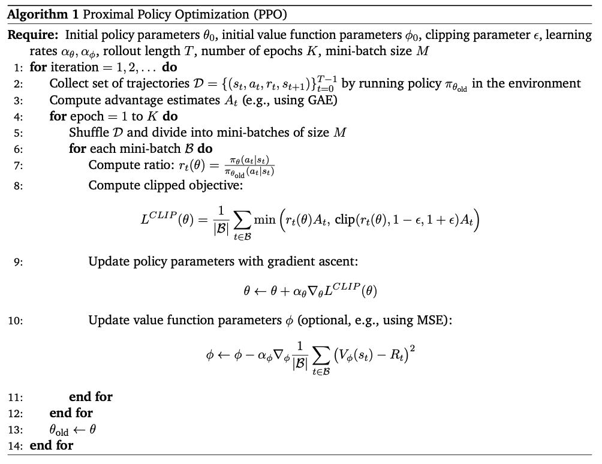

### 1. The Policy Gradient Foundation

The standard policy gradient theorem gives us:
$\nabla_\theta J(\theta) = \mathbb{E}_{\tau \sim \pi_\theta} \left[ \sum_{t=0}^T \nabla_\theta \log \pi_\theta(a_t|s_t) A^{\pi_\theta}(s_t, a_t) \right]$
where $A^{\pi_\theta}(s_t, a_t)$ is the advantage function under the current policy $\pi_\theta$.
### 2. From On-Policy to Off-Policy via Importance Sampling

PPO wants to reuse data collected from an old policy $\mu = \pi_{\theta_{old}}$ to update the current policy $\pi_\theta$. This requires converting the expectation under actions from $\pi$ to actions from $\mu$ via importance sampling:
$\mathbb{E}_{a \sim \pi_\theta}[f(a)] = \mathbb{E}_{a \sim \mu} \left[ \frac{\pi_\theta(a|s)}{\mu(a|s)} f(a) \right]$

Applying this to the policy gradient:
$\nabla_\theta J(\theta) = \mathbb{E}_{(s,a) \sim \mu} \left[ \frac{\pi_\theta(a|s)}{\mu(a|s)} \nabla_\theta \log \pi_\theta(a|s) A^\mu(s, a) \right]$

This leads to the surrogate objective function:
$L^{CPI}(\theta) = \mathbb{E}_{(s,a) \sim \mu} \left[ \frac{\pi_\theta(a|s)}{\mu(a|s)} A^\mu(s, a) \right]$

where CPI stands for “Conservative Policy Iteration.” The ratio $r_t(\theta) = \frac{\pi_\theta(a_t|s_t)}{\mu(a_t|s_t)}$ is called the **importance sampling ratio**. 
### What Problem Does PPO Solve?
All we have changed is the order of $\pi$ and $\mu$ in the KL term. However, there is no closed-form solution in this case. Instead, we return to gradient-based optimization.

Traditional policy gradient methods directly optimize the expected return by updating the policy parameters $\theta$ in the direction of the gradient:

$\nabla_\theta \mathbb{E}_{s \sim d^{\pi}(s),\ a \sim \pi_\theta(\cdot|s)} \left[ \sum_{t=0}^\infty \gamma^t r(s_t, a_t) \right]$

Now, instead we have $d^{\mu}(s)$ instead of $d^{\pi}(s)$, and an advantage term instead of the sum.
One of the ways we can approach this is to write down an explicit objective. We can approach this with importance sampling:
$\mathbb{E}_{x \sim p(x)} [f(x)] = \mathbb{E}_{x \sim q(x)} \left[ \frac{p(x)}{q(x)} f(x) \right]$
Using this, we change the expectation from under $\pi_\theta$ to $\mu$ and multiply by an importance weight:
$\mathbb{E}_{s \sim d^{\mu}(s),\ a \sim \mu(\cdot|s)} \left[ \frac{\pi_\theta(a|s)}{\mu(a|s)} A^{\mu}(s, a) \right] - \alpha D_{KL} \left( \mu(\cdot|s) \parallel \pi_\theta(\cdot|s) \right)$
Here, importance weights are less ‘finicky’, since they are for actions rather than states. For an Atari game, for instance, the state distribution is over every possible image in Atari, but the action space has a much lower dimensionality.

However, large updates to the policy can lead to performance collapse or instability. Trust Region Policy Optimization (TRPO) addressed this by constraining the policy update, but TRPO is complex and computationally expensive.

PPO solves this by introducing a simpler, more practical approach to limit policy updates, ensuring that each update is "proximal" to the previous policy.
### Intuition of Using KL Divergence
PPO uses the KL divergence $D_{KL}(\mu(\cdot|s) \parallel \pi_\theta(\cdot|s))$ to measure the difference between the old policy $\mu$ and the new policy $\pi_\theta$. By penalizing large KL divergence, PPO ensures that the new policy does not deviate too much from the old one, preventing destructive updates and encouraging stable learning: optimization function:
$\max_\theta\ \mathbb{E}_{s \sim d^\mu(s)} \left[ \mathbb{E}_{a \sim \pi_\theta(\cdot|s)} \left[ A^\mu(s, a) \right] - \alpha D_{KL}(\mu(\cdot|s) \parallel \pi_\theta(\cdot|s)) \right]$
### Why Does PPO Use Policy Gradient?
PPO is based on the policy gradient framework because it directly optimizes the expected return with respect to the policy parameters. This allows PPO to handle high-dimensional, continuous action spaces and stochastic policies, which are challenging for value-based methods.
### Why Is There No Closed-Form Solution as in AWR?
Algorithms like AWR (Advantage-Weighted Regression) can sometimes derive a closed-form solution for the optimal policy update due to their specific loss structure. In contrast, PPO's objective involves expectations over both the state and action distributions, as well as the KL penalty, making the optimization nontrivial and not amenable to a closed-form solution. Instead, PPO relies on stochastic gradient ascent to iteratively improve the policy.
### Advantages of PPO
- **Stable and Reliable**: By limiting policy updates, PPO avoids large, destabilizing changes.
- **Simple to Implement**: PPO does not require complex second-order optimization or constraints like TRPO.
- **Sample Efficient**: Can reuse data from old policies via importance sampling.
- **Widely Applicable**: Works well in both discrete and continuous action spaces.
### Disadvantages of PPO
- **No Closed-Form Update**: Requires iterative optimization, which can be slower than algorithms with closed-form solutions (like AWR in some cases).
- **Sensitive to Hyperparameters**: Performance can depend on the choice of KL penalty coefficient $\alpha$ and other settings.
- **Still Approximate**: The surrogate objective is an approximation and may not always perfectly reflect the true improvement.

### Why and How PPO Uses the Clipped Estimate
PPO replaces the explicit KL penalty with a **clipped surrogate objective** (as shown in the image) to limit how much the new policy $\pi_\theta$ can deviate from the old policy $\mu$ in a single update. Instead of directly penalizing the KL divergence, PPO clips the importance sampling ratio: $r(\theta) = \frac{\pi_\theta(a|s)}{\mu(a|s)}$
The objective becomes: $\mathcal{L}_{\text{CLIP}}(\theta) = \mathbb{E}_{s \sim d^\mu(s),\ a \sim \mu(\cdot|s)} \left[ \text{clip}(r(\theta), 1-\epsilon, 1+\epsilon) A^\mu(s, a) \right]$
This means if $r(\theta)$ moves outside $[1-\epsilon, 1+\epsilon]$, the advantage is not further increased, preventing excessively large policy updates.
### How PPO Improves the Clip Term
PPO improves stability by ensuring that the policy update does not push $r(\theta)$ too far from 1. This is a simpler and more robust alternative to enforcing a hard KL constraint or penalty, as it directly restricts the update at the level of each sample.
### Gradient Behaviors Induced by Clipping
- **Within the Clip Range:** When $r(\theta)$ is within $[1-\epsilon, 1+\epsilon]$, the gradient behaves like the standard policy gradient.
- **Outside the Clip Range:** When $r(\theta)$ exceeds the range, the gradient is zero with respect to $r(\theta)$, so further updates in that direction are suppressed.
- **Effect:** This prevents the policy from changing too much in a single update, reducing the risk of performance collapse.
### Limitations of Clipping
- **Bias:** Clipping introduces bias, as it may prevent the policy from fully exploiting large advantages if $r(\theta)$ is clipped.
- **No Direct KL Control:** While clipping restricts large updates, it does not directly control the average KL divergence, so the actual divergence can still drift over time.
- **Hyperparameter Sensitivity:** The choice of $\epsilon$ is critical; too small slows learning, too large risks instability.
- **Gradient Saturation:** If many samples are clipped, the effective gradient can become small, slowing down learning.
- **Hurts exploration of action space**: want more flexibility on the positive side, use asymmetric clip $\epsilon_{high}$ and $\epsilon_{low}$, especially in LLM. (DAPO)
**Summary:**
PPO’s clipped objective provides a simple, effective way to limit policy updates, improving stability over vanilla policy gradients, but at the cost of some bias and less direct control over the policy divergence.
