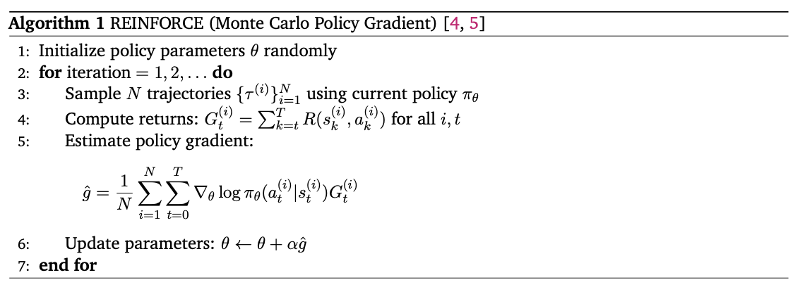
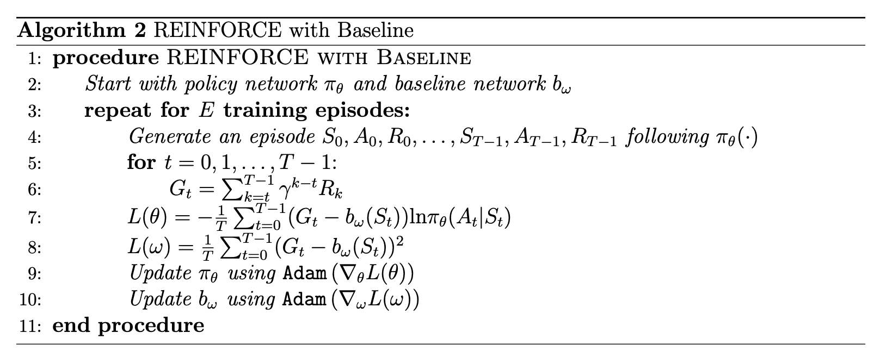

### Policy Optimization (Lecture 3)

#### **Definitions**
- **Policy Gradient update**:  
    $\theta_{\text{new}} = \theta_{\text{old}} + \Delta\theta, \quad \Delta \theta = \alpha \nabla_{\theta} J(\theta)$  
    where $J(\theta)$ is the expected return objective, and $\alpha$ is the learning rate.
- **Advantages over value based methods**: 
	- Effective in high-dimensional or continuous action spaces
	- Can learn stochastic policies
- **Policy Functions**
    - **Deterministic continuous policy**: $a = \pi_\theta(s)$  Example: DDPG (Deterministic Policy Gradient).
    - **Stochastic continuous policy**:  $a \sim \mathcal{N}(\mu_\theta(s), \sigma^2_\theta(s))$  Example: PPO with Gaussian policies.
    - **Stochastic discrete policy**:  $∑a′exp⁡(hθ(s,a′))\pi_\theta(a \mid s) = \frac{\exp(h_\theta(s,a))}{\sum_{a'} \exp(h_\theta(s,a'))}$  (Softmax over action preferences).
- **Policy Objective**:  
    The goal is to maximize the expected return:  
    $\max _\theta \quad U(\theta)=\mathbb{E}_{\tau \sim P(\tau ; \theta)}[R(\tau)]=\sum_\tau P(\tau ; \theta) R(\tau)$
    $\max _\theta . \mathbb{E}_{x \sim P(x ; \theta)} f(x)$
- **Probability of trajectory:**
    $P(\tau ; \theta)=\prod_{t=0}^H \underbrace{P\left(s_{t+1} \mid s_t, a_t\right)}_{\text {dynamics }} \cdot \underbrace{\pi_\theta\left(a_t \mid s_t\right)}_{\text {policy }}$
#### **Derivations**
- **Gradient of expectations (likelihood ratio trick):**  
    For random variable $x \sim P_\theta$: $\nabla_\theta \mathbb{E}_x[f(x)] = \mathbb{E}_x[\nabla_\theta \log P_\theta(x) f(x)]$  In practice (Monte Carlo estimate):  
I can obtain an unbiased estimator for the gradient by sampling!
From the law of large numbers, it will converge to the right gradient with infinite number of samples.
	$\nabla_\theta \mathbb{E}_x f(x)=\mathbb{E}_{x \sim P_\theta(x)}\left[\nabla_\theta \log P_\theta(x) f(x)\right] \approx \frac{1}{N} \sum_{i=1}^N \nabla_\theta \log P_\theta\left(x^{(i)}\right) f\left(x^{(i)}\right)$
- **REINFORCE estimator**  
    $\nabla_\theta U(\theta) =\mathbb{E}_{\tau \sim P_\theta(\tau)}\left[\nabla_\theta \log P_\theta(\tau) R(\tau)\right]$ 
    $\approx \frac{1}{N} \sum_{i=1}^N \nabla_\theta \log P_\theta\left(\tau^{(i)}\right) R\left(\tau^{(i)}\right)$
    $\approx \frac{1}{N} \sum_{i=1}^N \sum_{t=1}^T \nabla_\theta \log \pi_\theta\left(\alpha_t^{(i)} \mid s_t^{(i)}\right) R\left(\tau^{(i)}\right)$
- **The policy gradient estimator has an intuitive interpretation:**
	-  Increase the probability of actions in trajectories with positive rewards
	- Decrease the probability of actions in trajectories with negative rewards
	- The magnitude of the update is proportional to the trajectory reward
In each iteration of a reinforcement learning algorithm, we would (1) sample some trajectories, (2) calculate the rewards of those sampled trajectories, and (3) update the parameters 𝜃so as to move the mean of the distribution 𝜇 closer to the samples that give positive rewards, thus making those trajectories more probable.
#### **Gradient for specific policy classes**
- **Gradient for Gaussian Policy:**
	- univariate
	$\pi_\theta(a \mid s)=\mathcal{N}\left(a ; \mu_\theta(s), \sigma^2\right):\nabla_\theta \log \pi_\theta(a \mid s)=\frac{\left(a-\mu_\theta(s)\right)}{\sigma^2} \nabla_\theta \mu_\theta(s)$
	- multi-variate
	$\pi_\theta(a \mid s)=\mathcal{N}\left(a ; \mu_\theta(s), \Sigma\right): \nabla_\theta \log \pi_\theta(a \mid s)=\Sigma^{-1}\left(a-\mu_\theta(s)\right) \frac{\partial \mu_\theta(s)}{\partial \theta}$

- **Gradient for Softmax Policy for Discrete Actions**
	For discrete action space $A$:  
	$\pi_\theta(a \mid s) = \frac{\exp(\theta^\top \phi(s,a))}{\sum_{a'} \exp(\theta^\top \phi(s,a'))}$
	where $\phi(s,a)$ is a feature representation.
	- Ensures probabilities are non-negative and sum to 1.
	- Naturally differentiable → easy gradient computation.
$$
\begin{aligned}
\nabla_\theta \log \pi_\theta(a \mid s) &= \nabla_\theta\left[\log \frac{e^{h_\theta(s, a)}}{\sum_b e^{h_\theta(s, b)}}\right] \\
&= \nabla_\theta\left[\log e^{h_\theta(s, a)} - \log \sum_b e^{h_\theta(s, b)}\right] & \text{(log of fraction becomes difference)} \\
&= \nabla_\theta\left[h_\theta(s, a) - \log \sum_b e^{h_\theta(s, b)}\right] & \text{(log of exponential is the exponent)} \\
&= \nabla_\theta h_\theta(s, a) - \nabla_\theta \log \sum_b e^{h_\theta(s, b)} & \text{(distribute gradient)} \\
&= \nabla_\theta h_\theta(s, a) - \frac{1}{\sum_b e^{h_\theta(s, b)}} \nabla_\theta \sum_b e^{h_\theta(s, b)} & \text{(chain rule)} \\
&= \nabla_\theta h_\theta(s, a) - \frac{1}{\sum_b e^{h_\theta(s, b)}} \sum_b \nabla_\theta e^{h_\theta(s, b)} & \text{(gradient of sum is sum of gradients)} \\
&= \nabla_\theta h_\theta(s, a) - \frac{1}{\sum_b e^{h_\theta(s, b)}} \sum_b e^{h_\theta(s, b)} \nabla_\theta h_\theta(s, b) & \text{(chain rule)} \\
&= \nabla_\theta h_\theta(s, a) - \sum_b \frac{e^{h_\theta(s, b)}}{\sum_b e^{h_\theta(s, b)}} \nabla_\theta h_\theta(s, b) & \text{(push scalar sum into summation)} \\
&= \nabla_\theta h_\theta(s, a) - \sum_b \pi_\theta(s, b) \nabla_\theta h_\theta(s, b) & \text{(softmax policy definition)}
\end{aligned}
$$
#### **Temporal Structure**
So far, our derivation for the policy objective gradient assigns the blame (or reward) of the full trajectory 𝑅(𝜏(𝑖)) to each action in the trajectory. However, actions later in the trajectory do not impact rewards from earlier in the trajectory and should not be blamed as such.
- MC vs TD: Monte Carlo (MC) targets $Gt​=∑_{k≥0}​γkr_{t+k}$​ are (asymptotically) **unbiased but high-variance** and require the end of an episode; TD(0) uses the bootstrapped target $r_t​+γV(s_t+1​)$, introducing **bias but dramatically lowering variance** and enabling online updates.
- Policy gradients sum contributions over all time steps:  
    $\nabla_\theta J(\theta) = \mathbb{E}\Bigg[\sum_{t=0}^T \nabla_\theta \log \pi_\theta(a_t \mid s_t) G_t\Bigg]$
    $\begin{aligned} \hat{g} & =\frac{1}{N} \sum_{i=1}^N \sum_{t=1}^T \nabla_\theta \log \pi_\theta\left(a_t^{(i)} \mid s_t^{(i)}\right) R\left(\tau^{(i)}\right) \\ & =\frac{1}{N} \sum_{i=1}^N \sum_{t=1}^T \nabla_\theta \log \pi_\theta\left(a_t^{(i)} \mid s_t^{(i)}\right)\left(\sum_{k=0}^T R\left(s_k^{(i)}, a_k^{(i)}\right)\right) \\ & =\frac{1}{N} \sum_{i=1}^N \sum_{t=1}^T \nabla_\theta \log \pi_\theta\left(a_t^{(i)} \mid s_t^{(i)}\right)\left(\sum_{k=0}^{t-1} R\left(s_k^{(i)}, a_k^{(i)}\right)+\sum_{k=t}^T R\left(s_k^{(i)}, a_k^{(i)}\right)\right) \\ & =\frac{1}{N} \sum_{i=1}^N \sum_{t=1}^T \nabla_\theta \log \pi_\theta\left(a_t^{(i)} \mid s_t^{(i)}\right)\left(\sum_{k=t}^T R\left(s_k^{(i)}, a_k^{(i)}\right)\right)\end{aligned}$
	$G_t= \sum_{k=t}^T R\left(s_k^{(i)}, a_k^{(i)}\right)$
- Credit assignment problem: rewards at later times are attributed back to earlier actions.
#### **REINFORCE- Monte Carlo**

#### **Variance Reduction**
- Gradient is unbiased, but needs a very large N.
- Monte Carlo estimators suffer from **high variance**.
    $\text{Var}(\hat{g}) = \text{tr}\left( \mathbb{E}\left[ (\hat{g} - \mathbb{E}[\hat{g}])(\hat{g} - \mathbb{E}[\hat{g}])^T \right] \right) = \sum_{k=1}^n \mathbb{E}\left[ (\hat{g}_k - \mathbb{E}[\hat{g}_k])^2 \right]$
- Solution: subtract a **baseline** $b(s_t)$ without changing expectation:  
    $\nabla_\theta J(\theta) = \mathbb{E}\Big[\nabla_\theta \log \pi_\theta(a_t \mid s_t)\, (G_t - b(s_t))\Big]$
- **Choices of baseline**:
    - Constant baseline $\hat{b} = \mathbb{E}[R(\tau)]$
    - Time-dependent baseline $b_t = \sum_{i=1}^N G_t^{(i)}$
    - State-dependent baseline $b(s)$
     $b(s) = \mathbb{E}[r_t + r_{t+1} + r_{t+2} + \dots + r_{T-1} | s_t = s] = V_{\pi}(s)$
- **Optimal baseline** (to minimize variance): the **state-value function** $V^\pi(s)$.