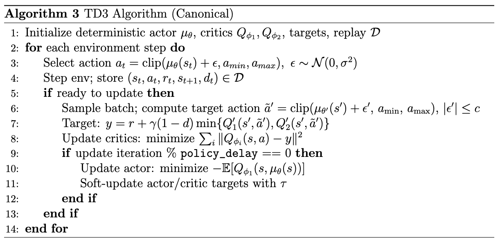

###  1. What is TD3?
TD3 = **Twin Delayed Deep Deterministic Policy Gradient**
- An **off-policy, actor–critic algorithm** for **continuous action spaces**.
- Built as an improvement over **DDPG**, addressing its instability.
###  2. Why was TD3 introduced?
**DDPG Problems:**
1. **Overestimation bias** in Q-values (similar to DQN).
2. **Exploiting function approximation errors** (policy pushes toward overestimated actions).
3. **Unstable actor updates** (actor learns from noisy critic).
**TD3 Fixes:**
- Introduces three key tricks to stabilize training:
1. **Twin Critics (Clipped Double Q-learning)**
    - Maintain two Q-networks $Q_{\varphi_1}, Q_{\varphi_2}$​​.
    - Target uses the **minimum**: $y = r + \gamma \min_{i=1,2} Q^{tgt}_{\varphi_i}(s', \pi^{tgt}_\theta(s'))$
    - Reduces overestimation bias.
2. **Target Policy Smoothing**
    - Add noise to target policy actions in critic target: $a' = \pi^{tgt}_\theta(s') + \epsilon, \quad \epsilon \sim \text{clip}(\mathcal{N}(0,\sigma), -c, c)$
    - Prevents critic from exploiting sharp Q-function peaks.
3. **Delayed Policy Updates**
    - Update actor less frequently than critics (e.g., 1 actor update for every 2 critic updates).
    - Actor only updates when critics are stable.
###  3. How TD3 Compares with DDPG
| Aspect            | **DDPG**                    | **TD3**                             |
| ----------------- | --------------------------- | ----------------------------------- |
| **Critic**        | Single Q                    | Twin Qs (min of two)                |
| **Target**        | Deterministic, no smoothing | Noisy target actions → smoother     |
| **Actor updates** | Every step                  | Delayed (less frequent)             |
| **Bias**          | Overestimation              | Mitigated via clipped double Q      |
| **Stability**     | Brittle, unstable           | Much more stable                    |
| **Performance**   | Weaker                      | State-of-the-art continuous control |
###  4. Advantages of TD3
✅ **More stable training** than DDPG.  
✅ **Reduces overestimation bias** with twin critics.  
✅ **Better performance** on continuous control benchmarks (MuJoCo, robotics).  
✅ **Sample efficient** (off-policy replay buffer).  
✅ **Simple extension of DDPG** (easy to implement once DDPG is in place).
###  5. Disadvantages of TD3
❌ Still **deterministic policy** → weak exploration compared to SAC.  
❌ More compute cost than DDPG (two critics instead of one).  
❌ Sensitive to hyperparameters (noise scale, policy delay).  
❌ Doesn’t explicitly encourage **policy stochasticity or robustness** (unlike MaxEnt methods).
###  6. Takeaway
- **TD3 = “DDPG but fixed.”**
- Solves DDPG’s overestimation and instability with **twin critics, target smoothing, delayed actor updates**.
- Works extremely well for continuous control benchmarks.
- But compared to **SAC**, TD3 has deterministic policies → less robust and exploratory.