## CMU 10601 Lecture Notes
###### Lucy Sun MCDS Fall 2024
### Memorizers
- Remember each data 
- It is not a model. It is not generalizable.
### Majority Vote
- Return prediction as the mode of training set. 
- Worst training error = 50%
- Problem: It only takes in label to make predictinos and not take any feature into account

### Decision Tree
#### Data Structure
- Tree is a type of graph that expands from root to leaf. It is important to identify leaf nodes when building and traversing the tree. Conditions depend on the structure of node but genrallly check 
  ```
  if node.left == None and node.right == None:
    This node is a leaf node
  ```
- Binary search tree
  - Each node has only 2 child nodes. 
  - It can be balanced or not balanced
  - Balanced tree are most efficient for searching[O(logn)]
#### When to split: 
- Error :
  - Based on the error rate this feature produces when splitting by majority vote. 
  - err = count(wrong pred by this feature) / count(all data in this node)$
- Entropy: 
  - Formula : $H(v) = -\sum_{v\in V(X)} P(X=v) log_2 (P(X=v))$ = $H(S) = -\sum_{v\in V(S)} \dfrac{\mid S_v\mid}{\mid S\mid} log_2 (\dfrac{\mid S_v\mid}{\mid S\mid})$
  - Entropy of all elements the same = 0
  - Entropy of elements splitting in half = 1
  - Note that in ID3, the bound of entropy is [0, $\log_2 N$] with N as number of classifications in y.
  
- Mutual Information / Information Gain
  - $I(Y;X) = H(Y) - H(Y\mid X) = H(y) - \sum_{v\in V(x_d)} f_v(H(Y_{x_d=v}))$
  
    | x    | y |
    | -------- | ------- |
    | 1  | 1    |
    | 1 | 0     |
    | 0    | 1   |
    | 0    | 0   |
  - $I = 1 - ( \dfrac{2}{4} \times 0 + \dfrac{2}{4} \times 1 )  = 0$


#### Construction
- Typical node structure:
    ```python
    class Node:
    '''
    Here is an arbitrary Node class that will form the basis of your decision
    tree. 
    Note:
        - the attributes provided are not exhaustive: you may add and remove
        attributes as needed, and you may allow the Node to take in initial
        arguments as well
        - you may add any methods to the Node class if desired 
    '''
    def __init__(self):
        self.left = None # left node
        self.right = None # right node
        self.attr = None # attribute to split on
        self.vote = None # which label this node predicts
        self.stats:dict = {} # distribution of labels
        self.entropy = -1 # entropy, initialized as -1
        self.depth = None # keep track of depth
    ```
- Typical tree functions:
  ```python
  def calc_entropy(self, y) # calculate the entropy for subsets
  def calc_mutual_info(self, x, y) # calculate mutual information/ information gain
  def split_attr(self, x, y) # calculate mutual information for each feature and decide which attribute to split on
  def split(self, train_x, train_y, depth) # recursive function for training
  def train(self) # calls split function add feed in training data
  def evaluate(self, mode) # make predictions with built tree
  ```

- Helper functions:
  ```python
  def print_tree(node:Node, result:str, attr:str, vote:int) # prints struture of the tree recursively
  ```
- Basic idea of recursion in building or traversing tree:
  - Base case: hits leafnode. 
    - For building the tree, it means that the dataset is pure enough that cannot be splited by available features.
    - For traversing the tree, it means we have reach the leaf node. 
  - Call function to the left 
  - Call function to the right
  
- Pros:
  - Interpretable (Some paper use DT to analyse their results)
  - Efficient
  - Compatible with categorical features 
- Cons:
  - Greedy learning: every split is the best split at the time but not overall. Therefore, it does not guarantee to find the smallest tree. The model usually 
  - Overfit 
    - Model fits training data set too tight that it cannot generalize
    - When splitting on numeric values, it can split on infinite values, which may cause overfitting.
    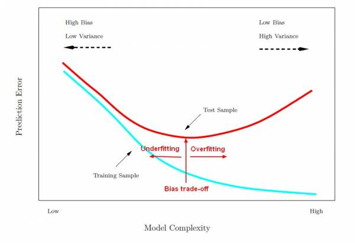
    - How to avoid overfitting:
      - Prune the tree 
        - Fixed depth
        - Higher Mutual information threshold
        - Lower Number of data in a node (lower branching factor)
        - Evaluate with validation set. 
        - Greedly remove split that decreases validation error rate
  
  - [Inductive bias](https://www.baeldung.com/cs/ml-inductive-bias) (We always make assumptions when building model): There are many inductive bias in DT: 
      - Shorter tres are always better
      - Majority vote classifier
  
### KNN
- Classify points closer to each other as the same label
- What is close?
  - Distance functions: 
    - Euclidean distance: $d(x, x')=\mid\mid x-x' \mid\mid _2 = \sqrt{\sum_{d=1}^{N}(x_d-x_d')^2}$
    - Manhattan distance: $d(x, x')=\mid\mid x-x' \mid\mid _1 = \sum_{d=1}^{N}\mid x_d-x_d'\mid$
    - Hamming distance: $d(uv, v) = \sum_{i=1}^3 \sum_{j=1}^3 \mathbb{1}(uv_{i,j} \neq vv_{i,j})$  = the number of pixels that differ between uv and vv
- Train:
  - Basically no training, just remember k
  - The nearest neighbor of a point is always itself
  - KNN is an instance based / non-parametric method
  - When k=1, the nearest neighbor of all points are themselves. Thus, 1-NN has training error = 0.
  - When training, include the point itself. e.g. k=3 means to train with hte point itself and 2 other nearest points.
- Predict:
  - Calculate the distance $d(u,v)$
  - Find the k nearest labels
  - Perform (weighted) majority vote
  - Decision Boundary is nonlinear
- Time:
  - Train: O(1)
  - Predict: O(MN), on average O($2^M \log N$) 
    - In practice, use stochastic approximations(fast and often as good)
  - k-NN works well with smaller datasets but runtime struggles when dataset becomes large
- Theoretical Guarantees:
  - error < 2 x Bayes Error Rate ('the best you can possibly do')
- Ties for voting:
  - Drop k to odd number
  - Distance weighted - closer points have larger weights
  - Select randomly
  - Get closest
  - Another distance metric
  - Remove farthest
  - Note: when distance of points are equal, it can also create a tie
- Inductive Bias
  - Scale of features will impact value of distance a lot (e.g. cm vs m)
  - All features are equally important
  - Choice of distance matters a lot
- Overfitting
  - Increase k will decrease chances of overfitting, resulting in a smoother decision boundary, picking up less noise and outliers
  - We can also cross-validate to help pick k
  - Increase number of training data will help decrease overfitting. 


### Model Selection 
- Hyperparameter: tunable aspects of the model. It is differnt than model parameter which are decided by the model itself. Instead, hyperparameters restrict the domain of the model.
  - E.g. Max-depth of decision tree, splitting threshold, k for KNN
- Model: hypothesis space over which learning performs search
- Learning algorithm: data-driven search over hypothesis space
- We need a function capable of measuring the quality of a model- Validation: 
  - Hold out a set of training to perform prediction on. 
  - We choose the lowest validation error
  - Validation needs to be performed on unseen data
  - Cross validation: instad of use only part of training data. We use folds of data. 
    - Splitting training set into multiple folds. Pick each fold as validation, train on the rest of training data, then repeat until we have exhausted the data
    - Pro: Error is more stable
    - Con: slower computation
- Hyperparameter optimization
  - Grid search: search through all values in the input space
    - Pro: 
      - All combinations are exhausted. 
      - Guarnateed best set of hyperparameters if discrete sets of parameters 
  - Random Search: Pick a range of values for each parameter. Select each parameter randomly with some assumed distribution
    - Pro: 
      - Much faster (fewer iterations) to be in a relatively good range for good performance
      - Grid search may spend too much time on searching in the incorrect space.
    - Con: 
      - Likelihood to select duplicated parameters. As more sets of parameters have been run on, the probability of duplication increases. 
      - Not gauranteed to find the best parameters.
  


### Perceptron
- Linear classification models (Perceptron, logistic regression, naive bayes, support vector machine)
- Background Math
  - To illustrate $w_1x_1+w_2x_2+b>0$ geometrically, we can derive $x_2$ with w, $x_1$ and b
  - L2 norm = $\mid\mid a \mid\mid _2 = \sqrt{a^T a}$
  - Orthogonal matrices $a \dot b = 0$
  - Vector projection a onto b: $\dfrac{a^{T} b}{\mid\mid b \mid\mid _2}b$ 
    - Denote $\theta$ as angle between a and b. 
    - $\cos \theta = \dfrac{a^T b}{\mid\mid a \mid\mid \times \mid\mid b \mid\mid }$
    - Length of Projection = $\mid\mid a \mid\mid \times \cos \theta $
    - Projection Vector direction aligns with b = Length of Projection $\times \dfrac{b}{\mid\mid b \mid\mid}$
- Decision boundary: linear: {x: $w^Tx + b = 0$}
- Here we discuss binary classification denoted as {+1, -1}. Prediction : $\hat{y} = sign(\theta^T x + b)$
- Online learning:
  - Data arrive in stream. Model is learned gradually
  - In contrast, batch learning has the entire dataset at the beginning
  - e.g. stock market, email, recommenders, ads
- Perceptron online learning:
    ```
    intialize params
    for all examples:
        y_hat = sign(theta * x)
        if y_hat != y:
            theta = theta + y^i * x^i
            b = b + y^i
    ```
    - Batch learning: repeats scan the whole dataset until converge
    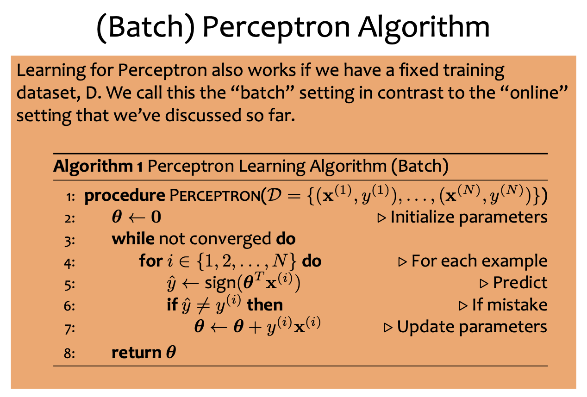
    - Size of w is same as size of each feature vector
- Interpretations:
  - Parameter w is a linear combination of all feature vectors
  - Vector w is orthogonal to decision boundary, pointing to positive predictions
  - Intercept term b: increasing b pushes decision boundary down
  - Only data that has been incorrectly predicted by perceptron is added to the parameters. This means that examples are not weighted equally
  - Perceptron Mistake Bound:
    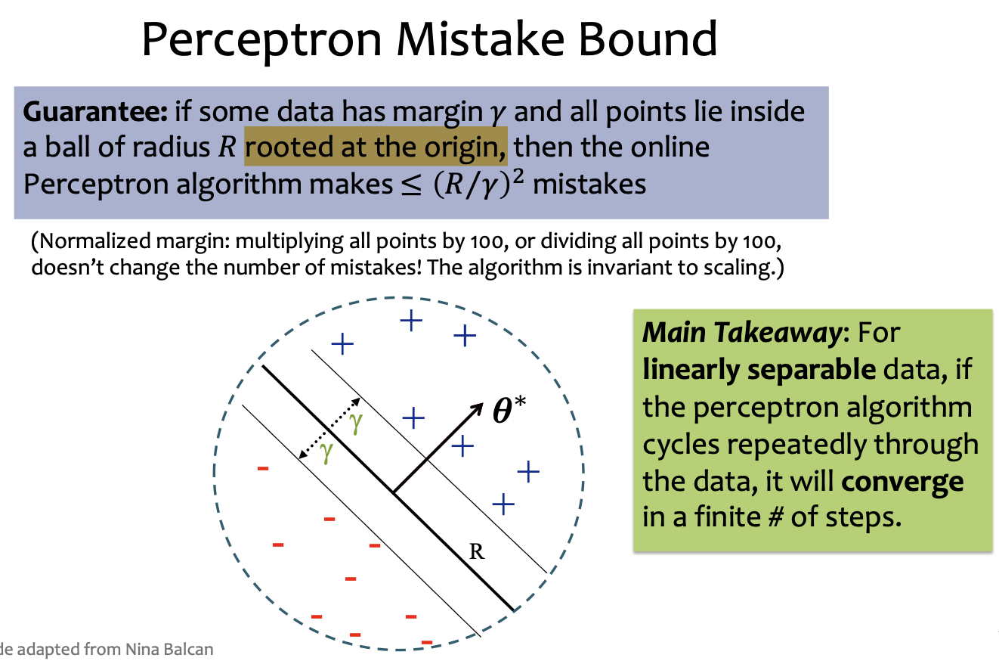
    - Note this R is distance from origin! Not center of data points
    - R circle covers all data. To calculate R, get the farthest from origin 
    - <span style="color:red">TODO: Proof of Mistake Bound</span>
  - If data is not linearly separable, perceptron will never converge.
    - An extension would be project into higher dimensional space
    - <span style="color:red">TODO: higher dimension perceptron</span>
  - Perceptron may also overfit
- Inductive Biases:
  - Newer data are more important than older data. Perceptron updates parameters as data arrives
  - Different order of data will give different models

---- End of Exam 1 -------

### Linear Regression
- Regression:
  - Decision tree regression: pick a splitting criteria (e.g. mse, mae)
  - KNN regression: pick a voting method
- Linear Functions
  - Linear functions $\neq$ linear decision boundaries
    - linear functions: $y=w^Tx+b$
    - linear boundary: $sign(y=w^Tx+b)$
- Key idea of linear regression: Find minimized square sum of residuals, which is a kind of optimization: Given $J(\theta)$ find $\hat{\theta} = argmin_{\theta\in\mathbb{R}^M}J(\theta)$
- Optimization:
  - ML optimization:
    - Function may not be true goal
    - Stopping early can help generalization error -> regularization
    - Methods include: gradient descent, closed form, stochastic gradient descent...
- Random guess
  - Pick random $\theta$
  - Evaluate J
  - Repeat
  - Pick $\theta$ with smallest J

### Gradient Descent
- [Matrix Calculus](https://en.wikipedia.org/wiki/Matrix_calculus)
  - Gradient: $\dfrac{\delta J(\theta)}{\delta\theta} = [\dfrac{dJ(\theta)}{d\theta_1}, \dfrac{dJ(\theta)}{d\theta_2},..., \dfrac{dJ(\theta)}{d\theta_M}]$
  - Gradient points to the fastest rise in the function
- Algorithm
  - choose initial $\theta$
  - Repeat:
    - compute gradient g
    - select step size $\lambda\in\mathbb{R}$
    - update $\theta = \theta - \lambda g$
    - stop until reach stopping criteria (e.g. g $\approx$ 0, norm g < small number)
  - return best $\theta$
- Interpretation
  - Wrong stepping size:
    - Too big: might diverge 
    - Too small: takes too many steps to stop
    - We can always update $\lambda$ after each loop. Generally, we want a larger stepping size in the beginning and decrease as we approach the solution
- Linear Regression + Gradient Descent
    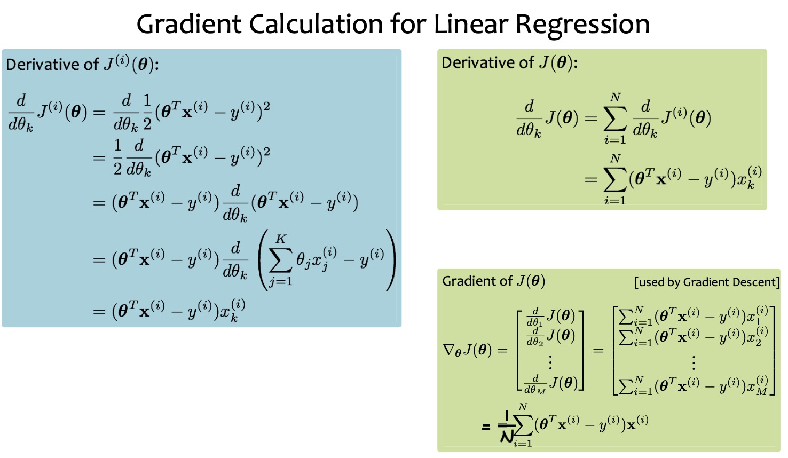
- Algorithm
  ```
  theta = theta_0
  while g > esp:
    g = 1/N * np.sum((theta * xi - yi) * xi)
    theta = theta - lambda * g
  ```

### Optimization
- Convexity
  - $f(cx^{(1)} + (1-c)x^{(2)}) \le cf(x^{(1)}) + (1-c) f(x^{(2)}) with  0\le c\le 1$
  - Strictly Convex
    - $f(cx^{(1)} + (1-c)x^{(2)}) < cf(x^{(1)}) + (1-c) f(x^{(2)}) with  0 < c < 1$
  - Convex functions look like v
  - Concave functions look like cave
  - L2 Regularization is convex but not strictly convex
  - Strictly convex functions have 0 or 1 minimizers


### Logistic Regression
- Goal: to predict true or false with a [logistic function](https://medium.com/@karan.kamat1406/how-logistic-regression-works-the-sigmoid-function-and-maximum-likelihood-36cf7cec1f46#:~:text=The%20sigmoid%20function%20is%20more,logistic%20regression%20than%20other%20functions.) (ex. sigmoid, tanh)
- Calculus basics
  - For iid samples with probability mass distribution $p(X\mid\theta)$, likelihood functions is $L(\theta)=\Pi_{n=1}^N p(x^{(n)}\mid\theta)$
  - The log likelihood is the log of L above: $l(\theta)=\log\Pi_{n=1}^N p(x^{(n)}\mid\theta) = \sum_{n=1}^N \log p(x^{(n)}\mid\theta)$
- Maximum likelihood estimation
  - This is the base of logistic regression. Logistic regression is trying to find the max likelihood fitting logistic funtion to the given training data
  - Def: method to estimate the parameters of a distribution given some data
  - First we need to assume a distribution of the dataset
  - Then fit the data to the distribution, trying to find the best parameters
  - We would like to make likelihood of samples maximized. Intuition is that we are assigning as much probability mass to observed data
- [Exponential distribution](https://en.wikipedia.org/wiki/Exponential_distribution)
   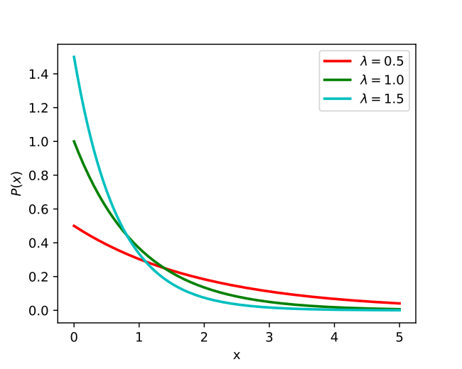
  - pdf: $f(x\mid\lambda)=\lambda \exp^{-\lambda x}$
  - 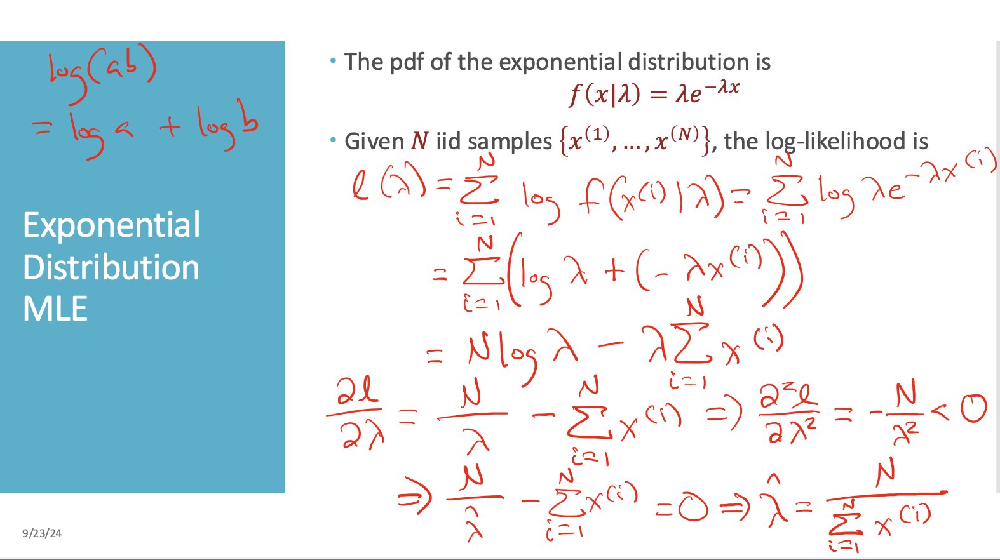
  - <span style="color:red">TODO: Type these formulas</span>
- Assumptions
  - y is binary labels - {True, False}
  - $P(Y=1\mid x,\theta) = \sigma(\theta^Tx) = \dfrac{1}{1+exp(-\theta^Tx)} = \dfrac{exp(\theta^Tx)}{exp(\theta^Tx)+1}$
- Implications
  - $P(Y=0\mid x,\theta) = 1 - P(Y=1\mid x,\theta) \newline = 1 - \dfrac{exp(\theta^Tx)}{exp(\theta^Tx)+1} = \dfrac{1}{1+exp(\theta^Tx)}$
  - $\dfrac{P(Y=1\mid x,\theta)}{P(Y=0\mid x,\theta)} = exp(\theta^Tx)$
  - 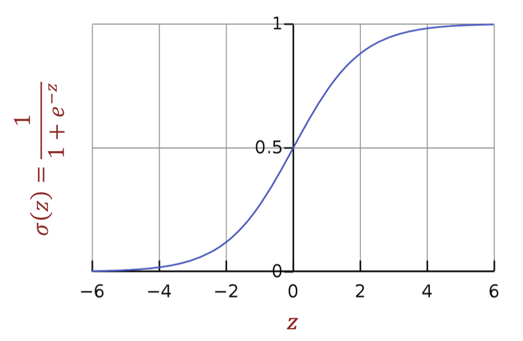
    - Maps $\theta^Tx$ to (0,1)
    - differentiable everywhere
    - Decision boundary is linear in x
    - $\hat{y}$ = 1 if $P(Y=1\mid x,\theta) \ge 0.5$
      - $\theta^Tx=0$ when $y=1$ 
- [Bayesian logistic regression](https://towardsdatascience.com/cross-entropy-negative-log-likelihood-and-all-that-jazz-47a95bd2e81)
- 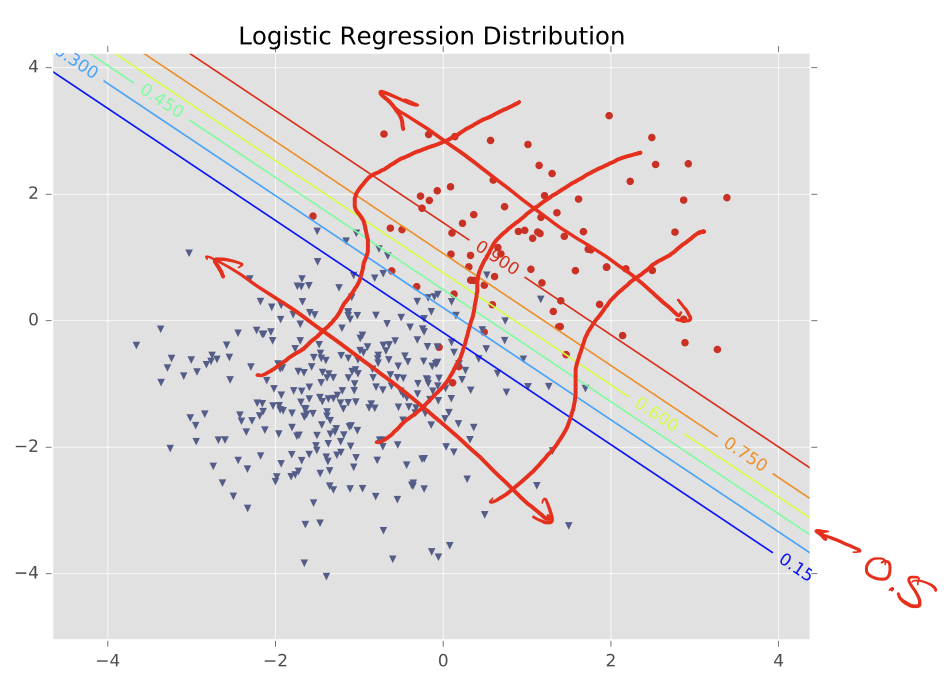
- To be consistent with ML conventions, we want to minimize negative conditional log-likelihood estimation
- Derivation of loss function $l(\theta)$ and  objective function $J(\theta) = -\dfrac{1}{N}\sum_{i=1}^N y^{(i)}\log(P(Y=1\mid x^{(i)},\theta)) +(1-y^{(i)})\log(P(Y=0\mid x^{(i)},\theta))$
  - Loss function is negative log likelihood of y's given x's
 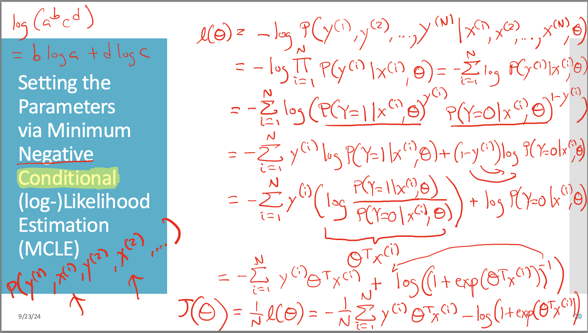
- Gradient Calculations
 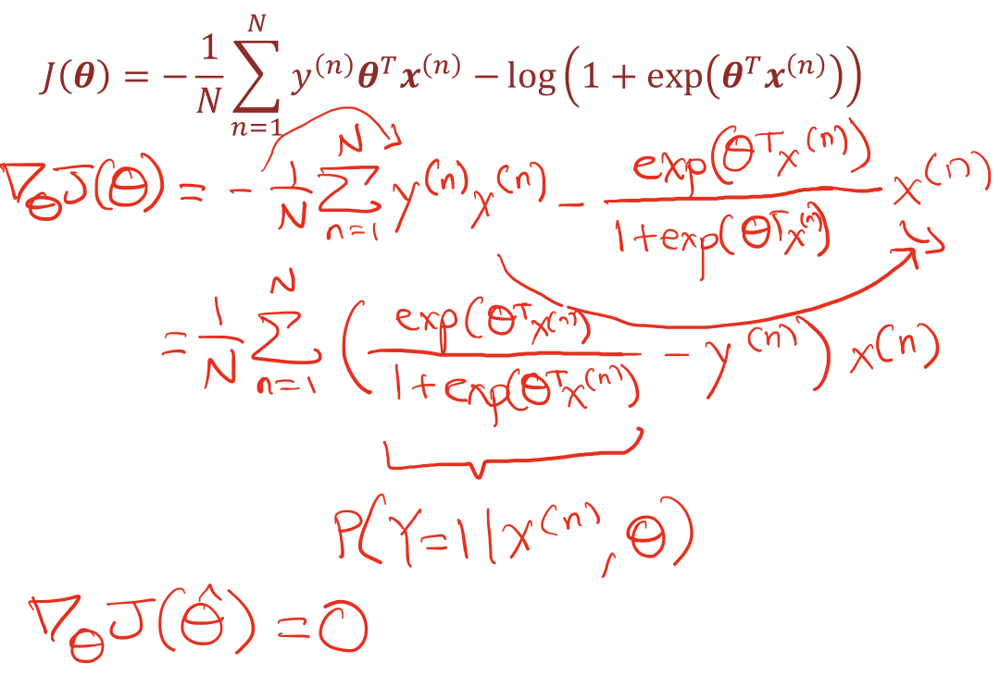
- Gradient Descent
  - Inputs: training dataset, step size $\gamma$
  ```python
  while termination criteria not satisfied 
    randomly sample point from dataset
    gradient = compute gradient 
    theta = theta - gamma * gradient

  return theta
  ```

### Stochastic Gradient Descent
- In general, there are 3 types of gradient descent
  - Batch GD: use entire dataset (batch) at each iteration
    - $g=dJ(\theta) = \dfrac{1}{N}\sum_{i=1}^N(dJ^{(i)}(\theta))$
  - Stochastic GD: Approximate gradient by gradient of one random sample
    - $g=dJ(\theta) = dJ^{(i)}(\theta)$
  - Mini-batch GD: Approximaet by random S samples
    - $g=dJ(\theta) = \dfrac{1}{S}\sum_{i=1}^S(dJ^{(i)}(\theta))$
    - higher S -> lower variance, higher memory usage
- SGD is used for optimizing computational inefficiency of traditional GD
- SGD uses a random single traing example to calculate gradient and update parameters
 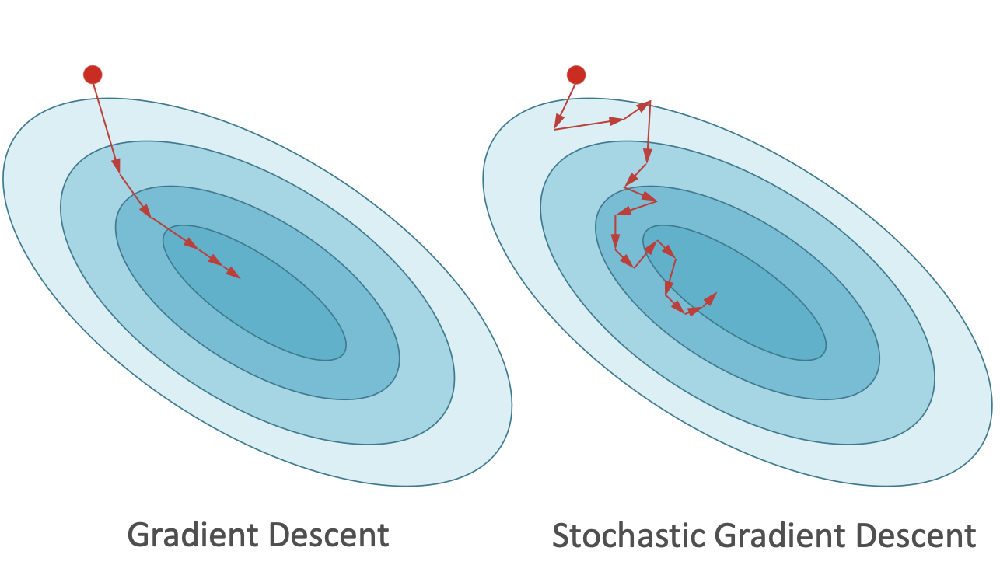
- epoch: single pass through the enture training dataset
  - parameters are updated N times per epoch
- Comparison
    |method   | Steps to converge    | Computation per step | 
    | -------- | ------- |------- |
    | Gradient Descent|$O(log\dfrac{1}{\epsilon})$  | $O(ND)$    |
    | SGD|$O(\dfrac{1}{\epsilon})$  | $O(D)$    |
  - Empirically SGD reduces log likelihood much faster

- Closed Form optimization
  - mean squared error ($J(\theta)=\frac{1}{N}\sum_{i=1}^N \frac{1}{2} (y^{(i)}-\theta^Tx^{(i)})^2$ $\frac{1}{2}$ is included here for computational convenience):
    - gradient = $\hat{\Theta} = (X^TX)^{-1}X^Ty$
    - When $X^TX$ is invertible, $\theta$ has single solution. When it is not invertible, there exists infinitely many solutions for $\theta$. 

### Bayes Optimal Classifier
- Naive Bayes assumption:
  - $P(Y=y\mid X=x) = \dfrac{P(X=x\mid Y=y)P(Y=y)}{P(X=x)}$
  - X features are independent from each other given y the labels
- Bayes Classifier
  - $h(x) = argmax_yP(y\mid x) = argmax_y\dfrac{P(x\mid y)P(y)}{z}$
    - Which z is a constant normalizer
  - $= argmax_y(P(y)\Pi_\alpha P(x_\alpha\mid y)) = argmax_y (logP(y) + \sum_\alpha P(x_\alpha\mid y))$
- [Notes from Cornell](https://www.cs.cornell.edu/courses/cs4780/2021fa/lectures/lecturenote05.html)


### Feature Engineering
<!-- - NLP exmaple:
- CV -->
- Non-Linear features
  - polynomial, sigmoid, radial basis function, log
  - The more features added, the more likely to overfit
  - Require no changes to the model, it's just preprocessing


### Regularization
- Overfitting: recall that overfitting is the case that the model is too complicated that it fits training set perfectly but performs poorly on testing set
- Regularization 
  - A way to keep the model simply, balancing between model complexity and fitting
  - Basically it's adding a penalty term of the model complexity to the training process
  - Goal: find $\theta = argmin_\theta(J(\theta) + \lambda r(\theta))$
    - with $J(\theta)$ as objective function
    -  $\lambda r(\theta)$ a penalty term 
  - Types:
    |method   | $r(\theta)$    | notes | 
    | -------- | ------- |------- |
    | $l0$|$\mid\mid\theta\mid\mid_0 = \sum\mathbf{1}(\theta_m\ne0)$  | Count non-zero values in $\theta$ ; usually not used in practice since it is not differentiable  |
    | $l1$ (Ridge) |$\mid\mid\theta\mid\mid_1 = \sum\mid\theta_m\mid$  | Subdifferentiable, absolute value of $\theta$ ; $\ell_1$ regularization prevents weights from going to infinity by reducing some of the weights to 0, effectively removing some of the features. |
    | $l2$ (Lasso) |($\mid\mid\theta\mid\mid_2)^2 = \sum(\theta_m^2)$  | Differentiable, $\theta^T\theta$ ; $\ell_2$ regularization prevents weights from going to infinity by reducing the value of some of the weights to \textit{close} to 0 (reducing the effect of a feature but not necessarily removing it).   |

  - Intercept term is not included in regularization
    - learning algorithm needs to shift y values with this intercept term


### Neural Networks
- Each set of neuron is a simple model. By connecting these neurons, it adds and and ors to the model, the model can be complex. 
- Activation functions: (softmax is also an activation function)
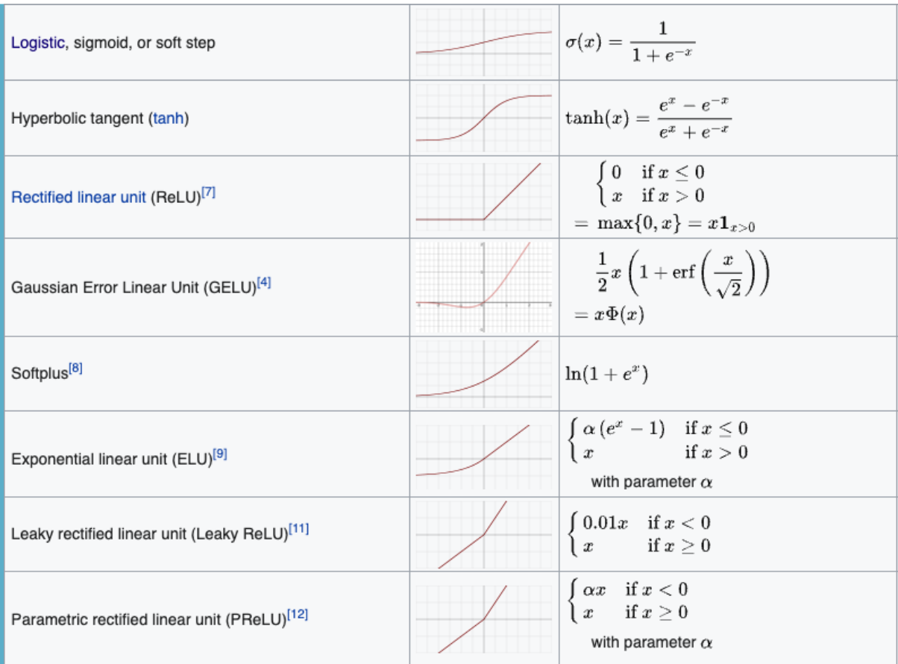
- Algo
  ```python
  initialize weights and biases
  while terminition criterion not satisfied:
    for loop
      compute gradient
      update w = w - learning_rate * gradient
  ```
- Design decisions:
  - no. hidden layers
  - no. hidden units
  - type of activation funtion
  - form of objective function
    - quadratic loss: $J = \frac{1}{2}(y-y^i)^2$ 
      - $\frac{\partial J}{\partial y} = y- y^i$
    - Binary cross entropy: $J=-(y^ilog(y)+(1-y^i)log(1-y))$
      - $\frac{\partial J}{\partial y} = - (y^i\frac{1}{y}+(1-y^i)\frac{1}{y-1})$
      - cross entropy has larger gradient with respect to weights.
  - how to initialize parameters
    - zero initial parameters: It is not reasonable to use zero initialization since a neural network with all neurons following the same path will have similar updates and hence the same weights. This also results in relatively limited model capacity and worse solution quality at convergence.
- Softmax:
  - $y_k = \frac{exp(b_k)}{\sum_{l=1}^k exp(b_l)}$
### Backpropagation
- bias term is usually not included in the backpropogation: they are not affected by any other vectors
- Convergence is based solely on training loss, not validation loss -- as the training loss decreases, the magnitude of the gradient updates decreases, causing the model to converge
- Taking differentiation
  - finite difference method:
    - Approximate differentiation by measuring the difference for the function with small changes
- Chain Rule:
  <!-- 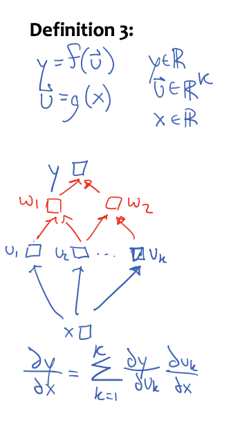  -->
  
  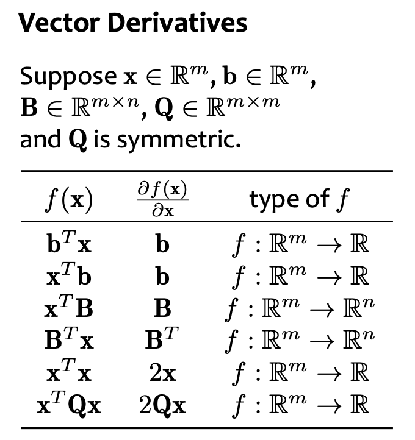
  <!--  -->
- Derivative for sigmoid:
  - $s = \frac{1}{1+exp(-b)}$
  - $\frac{\partial s}{\partial b} = \frac{exp(-b)}{(exp(-b)+1)^2} = s(1-s)$
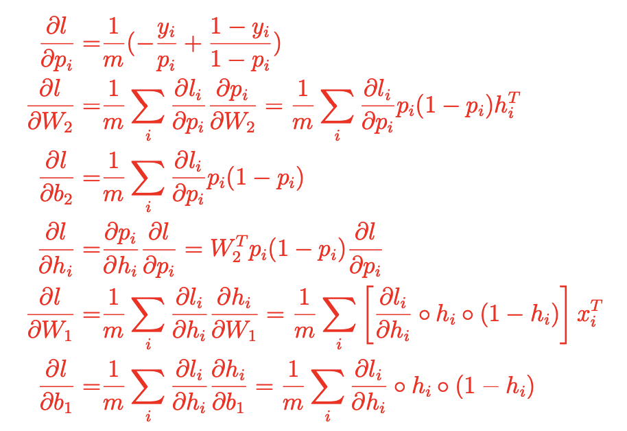
- Vanishing gradient:
  - sigmoid gradient is the cause: it is product of small probabilities
```python
for epochs:
  for datapoints in training data:
    o = object(x, y, alpha, beta) # forward prop
    g_a = gradient(J_a)
    g_b = gradient(J_b) # backprop
    # update parameters
    alpha -= learning_rate * g_a
    beta -= learning_rate * g_b
  # mean cross entropy
  J = J(alpha, beta)
return alpha, beta
```
- Why use backprop? computations from forward prop can be reused
  
### ML Social Impact 
- criterias to fit in human subjects
  - fair/equatible w.r.t. demographic groups
  - explainability/interpretability
  - privacy preserving
  - robustness to adversarial attack
  - data/distribution shift
  - transparency
  - environmentally-friendly
- Confusion matrix
-  |   | Predicted positive    | Predicted negative | 
    | -------- | ------- |------- |
    | Actutal Positive |True Positive (TP)  | False Negative (FN)    |
    | Actutal Negative | False Positive (FP) | True Negative (TN)    |
- Asymmetric may be a problem with model only evaluated with accuracy
- Other metrics:
  - False Positive rate = $\frac{FP}{N} = \frac{FP}{FP+TN}$
  - False negative rate = $\frac{FN}{P} = \frac{FN}{TP+FN}$
  - Positive Predictive Value (Precision) = $\frac{TP}{PP} = \frac{TP}{TP+FP}$
  - Negative Predictive Value (Recall) = $\frac{TN}{PN} = \frac{TN}{TN+FN}$
- Fairness definitions
  - Independece (Selection rate parity)
    - Definition: $P(h(X,A) = +1|A=a_i) = P(h(X,A) = +1|A=a_j) \forall a_i, a_j$
    -  Achieve fairness
      - Preprocessing
        - Preprocess the training data to be independent
        - Massaging the dataset
        - Reweighting the dataset (upweigh rare labels)
      - Additional constaints
        - regularization
      - Post-processing
    - But! permits laziness (flip a coin)
  - Separation
    - Definition: $P(h(X,A) = +1|Y=-1,A=a_i) = P(h(X,A) = +1|Y=-1,A=a_j) \forall a_i, a_j$ and $P(h(X,A) = -1|Y=+1,A=a_i)P(h(X,A) = -1|Y=+1,A=a_j) \forall a_i, a_j$
    - ROC(receiver operating characteristic) curve: y-axis TPR, x-axis FPR 
    - But! perpetuates existing biases in the training data, does not eliminate the bias
  - Sufficiency (equality of FPR and FNR)
    - Definition: 
    - Most off-the-shelf ML models can achieve sufficiency without intervention
  - Random classifier satisfies independence and separation but not sufficiency (????)


### PAC - Probably Approximately Correct Learning
- Notations:
  - $c^*$: true function
  - $h$: Hypothesis (possible model within a set of models, ex. linear regression with all parameters determined from training.)
  - $\mathbb{H}$: set of hypothesis
- Types of Risk
  - Expected Risk (true error)
  - Empirical Risk (training error)
- Relationship between $c^*$ and $\mathbb{H}$
  - Realizable and Agnostic
    - Realizable: $c^*\in \mathbb{H}$
  - Finite and Infinite:
    - $|\mathbb{H}| < \infin$ 
    - Finite: majority vote, decision tree
    - Infinite: linear boundaries
- True Error Bound
  - Here we want to know the bound for true error rate when training error is 0. 
  - Assumption: there are k bad hypothesis in $\mathbb{H}$
  - Given a dataset with M data points, we want to know the probability of the bad hypothesis predicts all points correctly. 
  - PAC learnable: $\exist \epsilon, \delta s.t. P(|R(h) - \hat{R}(h) | \le \epsilon) \ge 1-\delta \forall h\in H$

- VC Bounds
  - Shatter: First we can choose the shape/locations of the points to be separated by H. We need to test out all possible combinations of the labels and see if all of them can be separated with some h in H. 
  - If a set of points that can always be classified correctly with some h in H, H can shatter these points. 
  - VC dimension of H is the largest dimension that H can shatter. (There exists a dataset of k dimension that H can shatter. VC(H) = max(k))
  - For linear separators: VC_dim(H) = dim(H) + 1
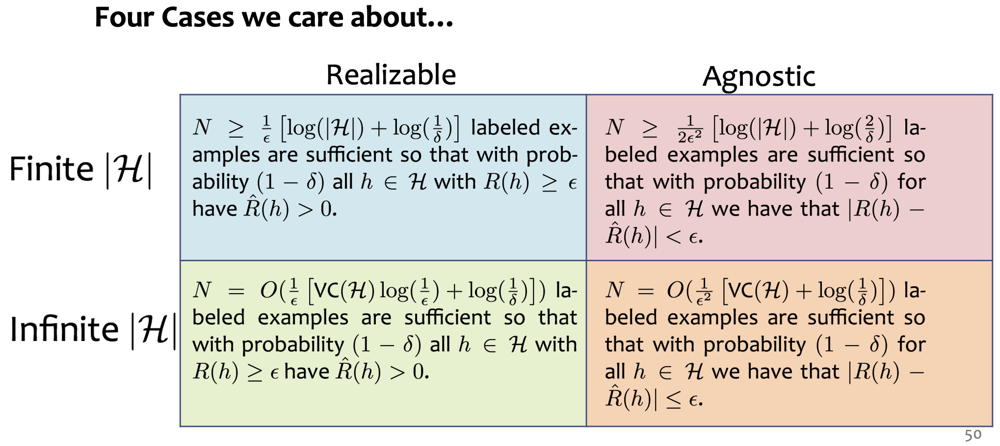


- MLE find $\hat{\theta} = argmax_\theta p(D|\theta)$
- MAP (Maximum a Posterior)
  - Post/Prior? 
    - In Bayensian probability theory, $p(x|\theta) = \frac{p(\theta|x)p(x)}{p(\theta)}$
    - In this case, in terms of likelihood $p(x|\theta)$, the prior is $p(\theta)$, posterior is $p(\theta|x)$
      - If the prior and posterior are in the same distribution family, they are the conjugate distributions with respect to the likelihood function.
    - MAP finds $\hat{\theta} = argmax_\theta p(\theta|D) = argmax_\theta p(D|\theta)p(\theta)/p(D)= argmax_\theta p(D|\theta)p(\theta)= argmax_\theta log (p(D|\theta))+log(p(\theta))$
- [Notes from Stanford](https://web.stanford.edu/class/archive/cs/cs109/cs109.1218/files/student_drive/7.5.pdf)

