##### CNN & RNN
<!-- - Filters/kernels: small matrix that convolved with same-sized sections of the image matrix -->
<!-- - padding: ensure border features captured
- pooling: downsampling -->
- pytorch output_size = (input_size - kernel_size + 2 * padding) / stride + 1
- RNN vanishing gradient: backprop through the layers makes gradient really small; The vanishing gradient problem leads to forgetting, as it causes the gradients
to become very small, reducing the network’s ability to learn dependencies
between distant sequence elements
- Downsampling: the goal is to reduce the output dimensionality. Some common methods
include pooling functions (e.g. maxpooling, mean pooling). These are appropriate for
larger images where you want to reduce the compute time/mitigate overfitting by making
the input to future convolutions less complex.
Upsampling: the goal is to increase the output dimensionality. Upsampling is generally
used when you want the output of a convolution to be larger e.g. match the input image
in dimensionality. For instance you might be assigning a label to each pixel of the output
and matching it with the input.
##### RNN-LM
- n-gram models: generate realistic looking sentences in a human language;condition on the last n-1 words to sample the nth word
  - $\Pi_{t=1}^{T} p(w_t|w_{t-1})$: count n-gram frequencies to get the probabilities
<!-- - 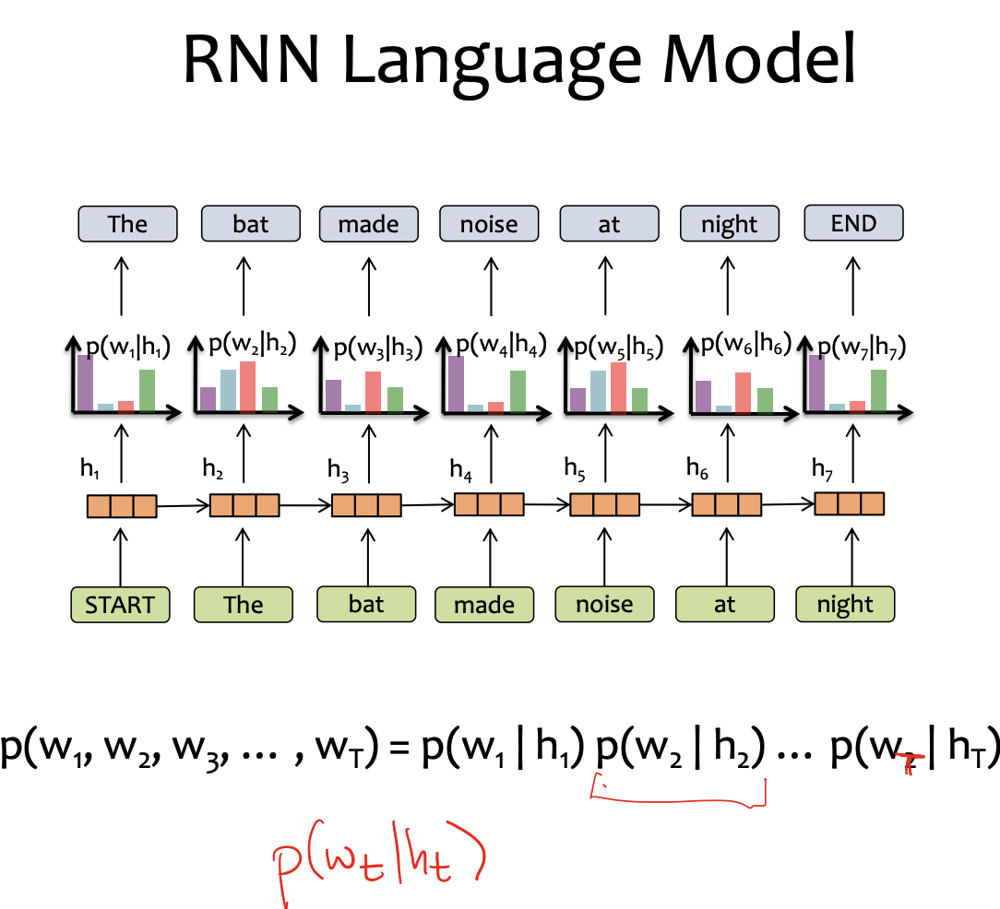 -->
  

  - convert all previous words to fixed length vector
  - define distribution $p(w_t|f_{\theta}(w_{t-1}, ..., w_1))$ conditioning on vector $h_t=f_{\theta}(w_{t-1}, ..., w_1)$
  <!-- - Learning RNN: part of speech tagging -->
<!-- - 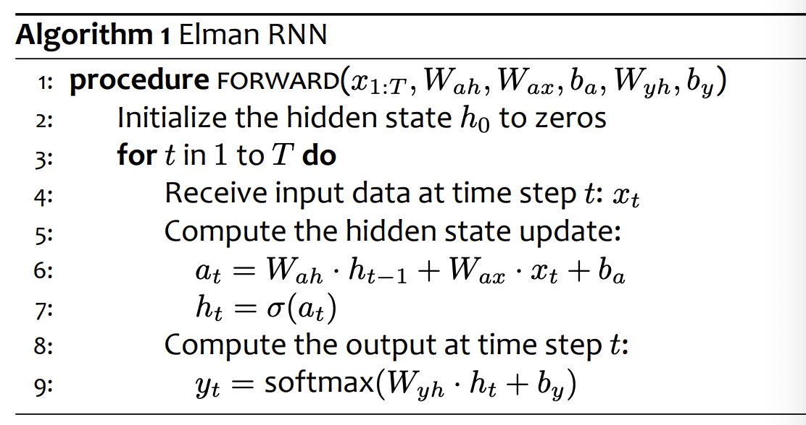 -->

  - multiheaded attention: allows a model to simultaneously focus on different aspects of an input sequence; the
model does a better job of capturing positional detail. Since it can also be parallelized
it also boosts computational efficiency which makes transformers more versatile
  - Concatenate all outputs to get a single vector for each time step
##### Transformer 
  - RNN computation graph grows linearly with number of input tokens; Transformer grows quadratically
  - Each layer consists of attention, feed-forward nn, layer normalization, residual connecton
  - residual connection: The Problem: as network depth grows very large, a performance degradation occurs that is not explained by overfitting (i.e. train / test error both worsen); One Solution: Residual connections pass a copy of the input alongside another function so that information can flow more directly: Instead of f(a) having to learn a full transformation of a, f(a) only needs to learn an additive modification of a (i.e. the residual). 
  - layer normalization: The Problem: internal
covariate shift occurs
during training of a deep
network when a small
change in the low layers
amplifies into a large
change in the high layers
• One Solution: Layer
normalization normalizes
each layer and learns
elementwise gain/bias
• Such normalization allows
for higher learning rates
(for faster convergence)
without issues of
diverging gradients; reordering such that
the LayerNorm’s came
at the beginning of
each set of 3 layers
- masking: prevent accessing future tokens; padding: all sequences in batch need to be same length;  Truncating longer sequences helps manage
computational resources and memory usage.
  <!-- - layer normalization:  -->
<!-- - 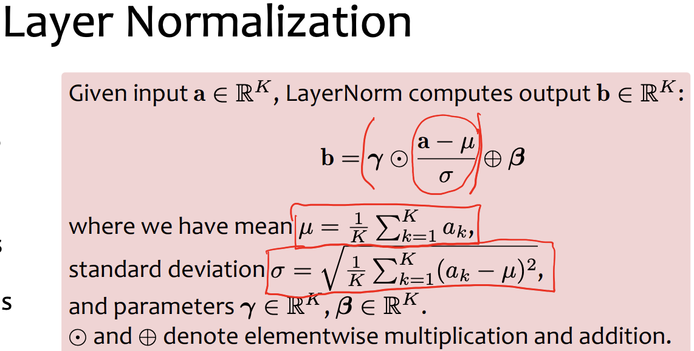 -->

<!-- ##### AudoDiff -->

##### Pre-training, Fine-tuning
- fix the just trained weights for later layers; use pre-trained weights as initialization
- supervised pre-training: measure error
- unsupervised: reconstruction error - autoencoder
- Overfitting  - not enough labeling, data -> use related pre-trained model
- not enought labelled data to fine-tune? -> in-context learning, pass a few examples to the model as input w/o performing updates 
  - few-shot, one-shot, zero-shot (in context)
- Choose fine-tuning when you need high accuracy on a specific task and have a dedicated dataset to train on, while in-context learning is preferable when you need quick adaptation to new tasks with minimal data, prioritizing flexibility and fast experimentation over peak performance on a single task
<!-- - RLHF -->
##### Reinforcement Learning
- Formulation: state space, action space, reward function (stochastic, deterministic), transition function, policy($\pi$ specifies an action to take in every state), value function($V^{\pi}: S\rightarrow R$ expected total payoff of starting in state s executing policy $\pi$)
<!-- 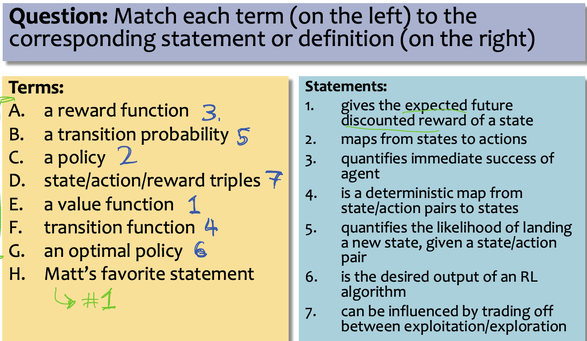 -->

- gives the expected future
discounted reward of a state - value function
- maps from states to actions - policy
- quantifies immediate success of
agent - reward function
- is a deterministic map from
state/action pairs to states - transition function
- quantifies the likelihood of landing
a new state, given a state/action
pair - transition probability
- is the desired output of an RL
algorithm - optimal policy 
- can be influenced by trading off
between exploitation/exploration - state/action/reward triples
- MDP: objective function: total reward $E[\sum_{t=0}^{\infin}\gamma^t r_t]$: infinite horizon expected future discounted reward
<!-- - Bellman's Equation -->
- Fixed Point Iteration: system of equations; rewrite with each variable on the LHS; update each parameter until converge

- Value iterations: det rewards, can be det or stochastic policy
<!-- 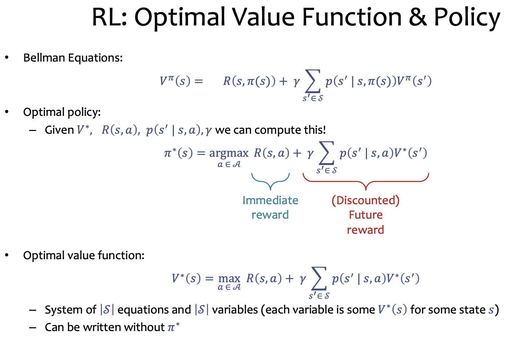
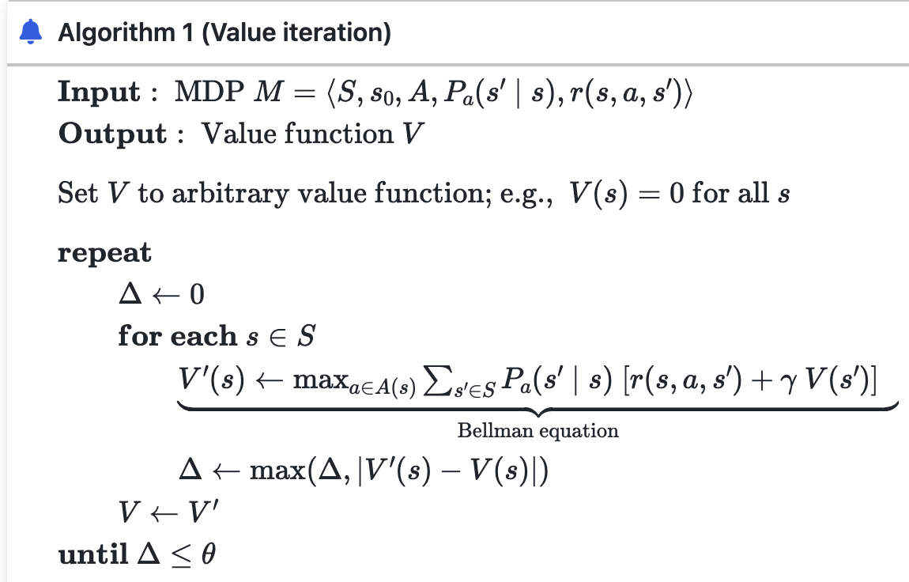
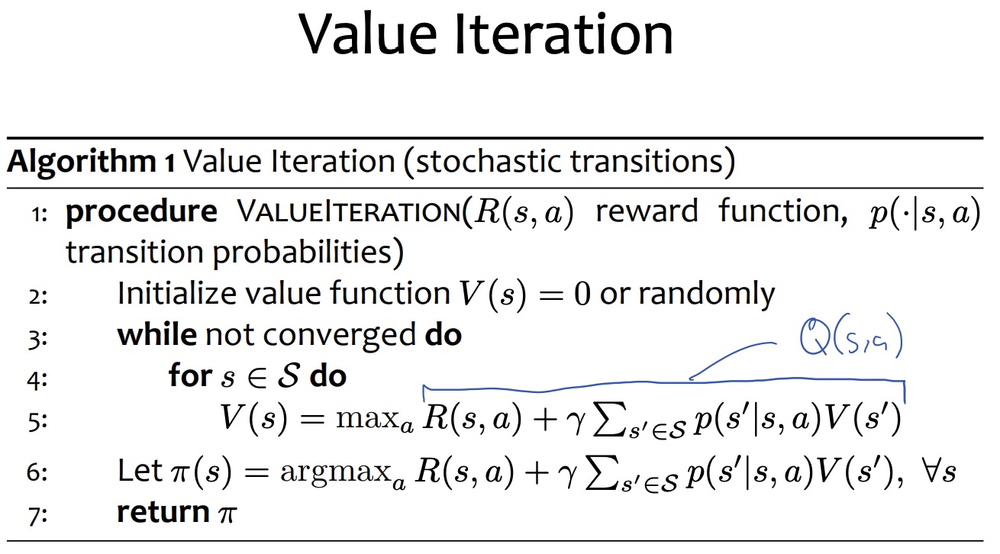
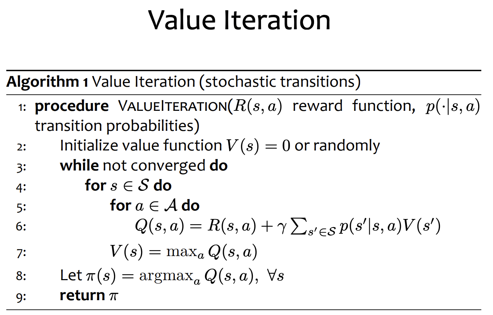
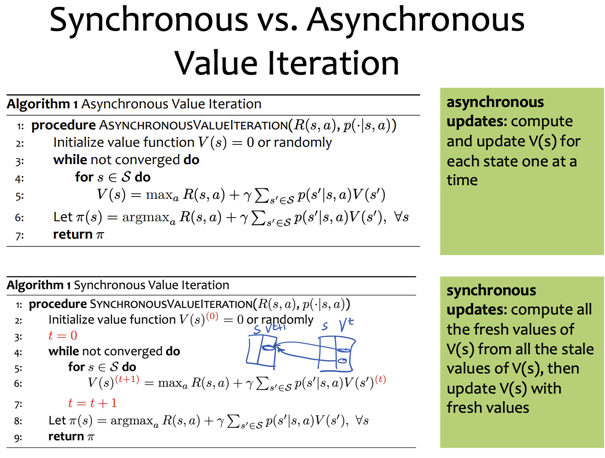
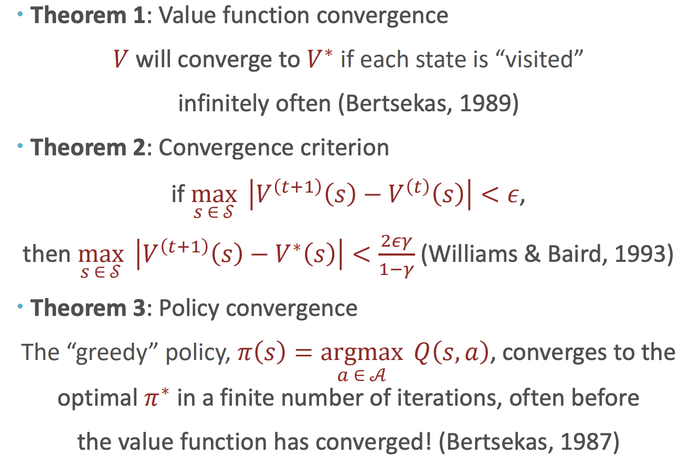
 -->

- Policy Iterations: stochastic rewards: deterministic rewards depending on the next state (transitions are stochastic)
<!-- 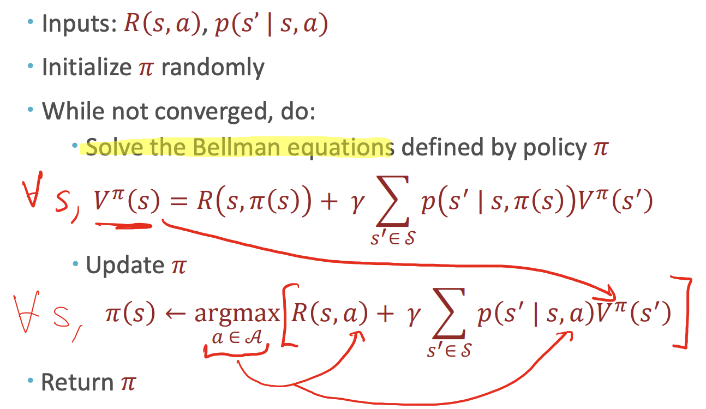 -->
<!--  -->
  - value iteration: $O(|S|^2|A|)$/iter for both stochastic and deterministic transition (certain on transition)
  - policy iteration: $O(|S|^2|A|+|S|^3)$/iter empirically requires fewer iterations
- Q-learning: problem: reward and transition funcs are unkonwn
    - online learning (Q-table)
    - $\epsilon$ online learning: with probability $1-\epsilon$ take random action; otherwise take greedy action: Temporal difference
    - Incorporating rewards from multiple time steps allows for a more ”realistic” estimate of the true total reward, since a larger percentage of it is from real experience.
It can help with stabilizing the training procedure, while still allowing training at
each time step (bootstrapping). This type of method is called N-Step Temporal
Difference Learning.
<!-- 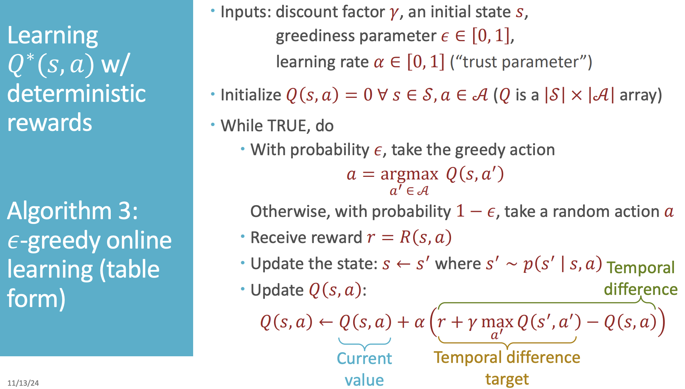 -->

  -  converge to optimal if every valid state-action pair is visited infinitely often; finite rewards; initial Q values are finite; learning rate follows some schedule
  - problem: infinite state/action spaces
    - Deep RL 
neural network: represent states with some feature vector; stochastic gradient descent (consider one state-action pair in each iteration): fundamentally connected to regression, uses nn to predict Q-value 
<!-- 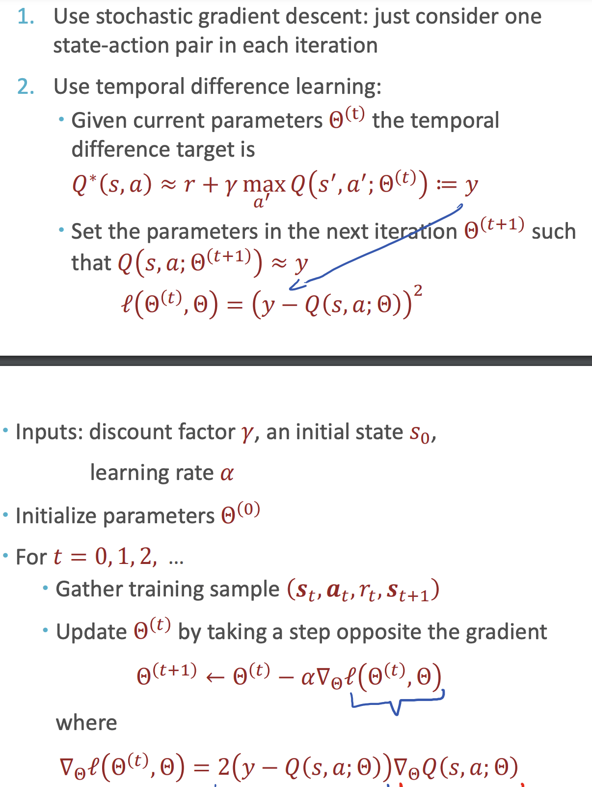 -->

<!-- - Experience replay: replay buffer; uniformly draw from the buffer for update -->

##### Recommender Systems
- content filtering: need external information; easy to add new items
- Collaboorative filtering: no sode information, not work on new items with no ratings 
  - neighborhood methods: kmeans
  - latent factor methods: matrix factorization (U: user factors, V: item factors)
    - uncontrained matrix factorization: use only observed data; alternating least squares
<!-- 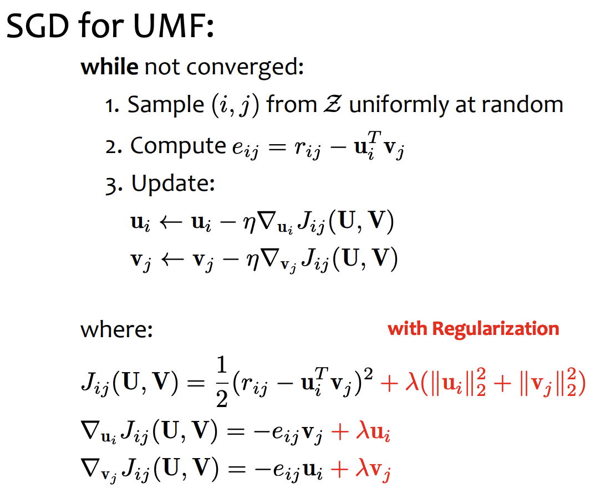 -->

- SVD:  If R fully
observed and no
regularization, the
optimal UVT from
SVD equals the
optimal UVT from
Unconstrained MF
    <!-- - NMF -->

##### PCA
- Centering/whitening the data to 0 mean
- Projection: $z = (\frac{v^Tx}{||v||_2})\frac{v}{||v||_2}$
- $\hat{v}=argmin_{v:||v||_2^2=1}\sum_{n=1}^N||x^{(n)}- (v^Tx^{(n)})v||_2^2=argmin_{v:||v||_2^2=1}v^T(X^TX)v$
- eigenvectors and eigenvalues $Av=\lambda v$; eigevectors of symmetricmatrices are orthogonal
- unique variance on each component
- SVD: $X=USV^T$ U cols and V cols are eigenvectors
- variance for ith PC: $\frac{\lambda_i}{\sum\lambda_i}$
- shortcomings: linear relationships, outliers, interpretability, information loss
- autoencoders: nn implicitly learn low-dimensional representations

##### Ensemble Methods
- Weighted Majority algo: only learns weight for classifiers; AdaBoost: learn weak learners and weights for each learner
<!-- 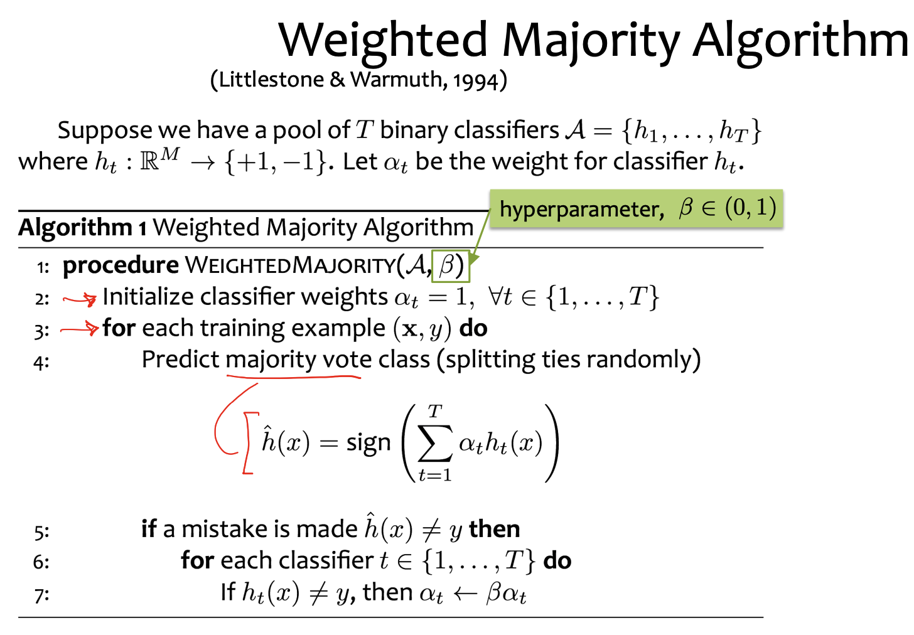 -->

- wma: Upper bounds on number of mistakes in a given sequence of trials: $O(log(|A|/k)+m/k)$ total number of mistakes of subpool of k algos of A is at most m
<!-- 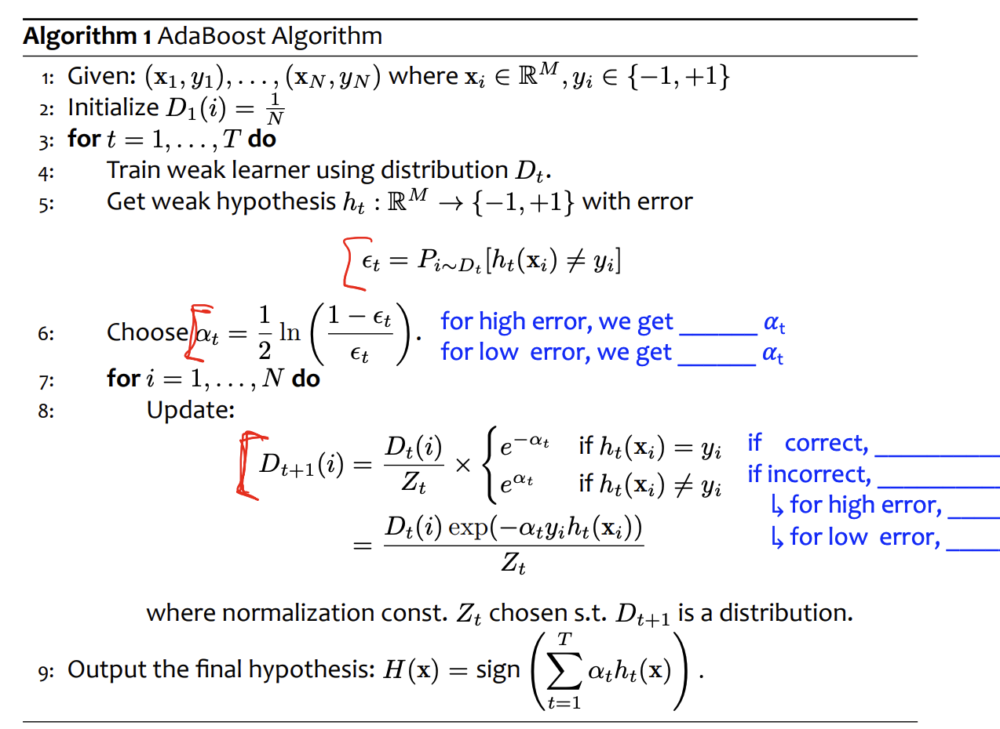 -->
- ada mistake bounds: if each weak hypothesis is slightly better than random so that $\gamma_t\ge\gamma$ for some $\gamma>0$ then training error drops exponentially fast
- ada generalization error: $Pr[H(x)\ne y]+O(\sqrt{\frac{Td}{N}})$ : d is VC dim of weak learner, T is boosting rounds, N is sample size; however, empirical results show adaboost does not tend to overfit
  

<!-- - Bagging: bootstrap aggregation -->
  <!-- - sample bagging: repeated sample with replacement -->
  <!-- - feature bagging: repeatedly sample w replacement subset of features -->
- random forest: draw sample of training examples; learn DT; each node randomly sample subset features before splitting; Random Forests do unweighted sums of the individual tree predictions
- OOB: error of a sample that are not used in training for some trees; can be used for hyperparameter optimization
- Feature importance: add the information gain for feature when selected
- Upper bound of generalization can be derived from accuracy of each individual classifier and dependence between them
##### Clustering (K-Means)
<!-- - objective: $argmin_C\sum_{i=1}^N min_j||x^{(i)}-c_j||_2^2$ -->
- Repeat: pick each cluster assignment to min distance; pick each cluster center to min distance (block coordinate descent)
- Initialization: 
  - random centers: works well when data from well-separated gaussians; may get stuck in local optima; can be arbitrarily bad; Pr[each initial cetner is in a diff Gaussian] $\approx \frac{1}{e^k}$: unlikely when k is large
  - furthest point heuristic: pick first cluster enter randomly, then pick each subsequent center farthest possible from previous centers; outliers as problem
  - k-Means++(Lloyd’s Method): Pick center proportional to $D^2(x)$: weighted probability distribution; in expectation O(log k) to optimal solution
- improve performance: choose k: elbo of curve; random restarts; 

 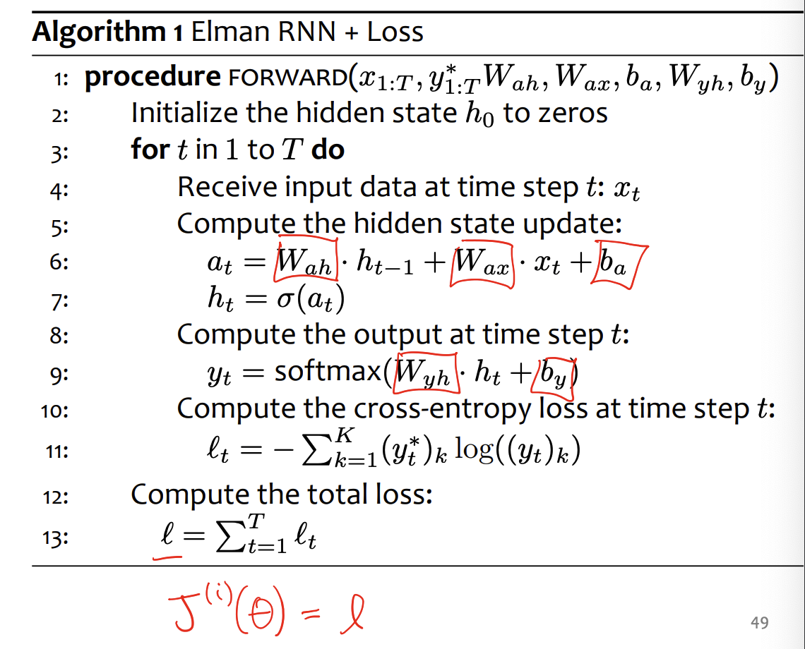 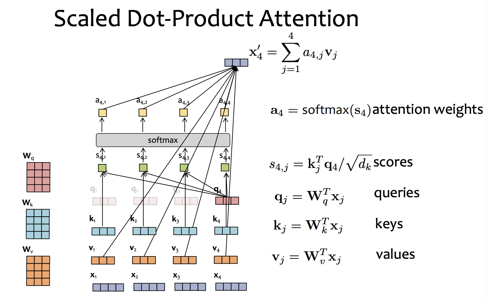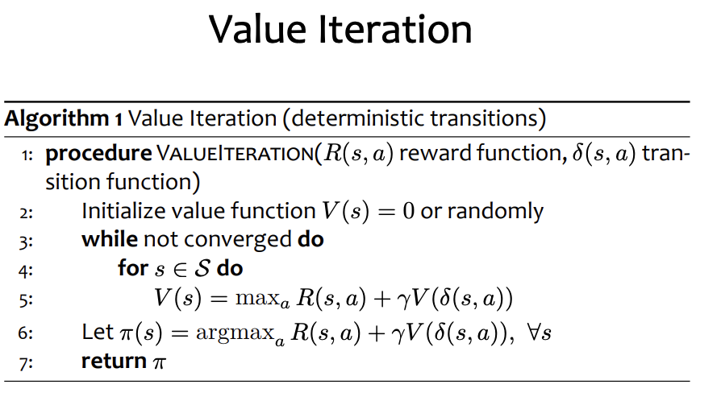

 <!--   -->