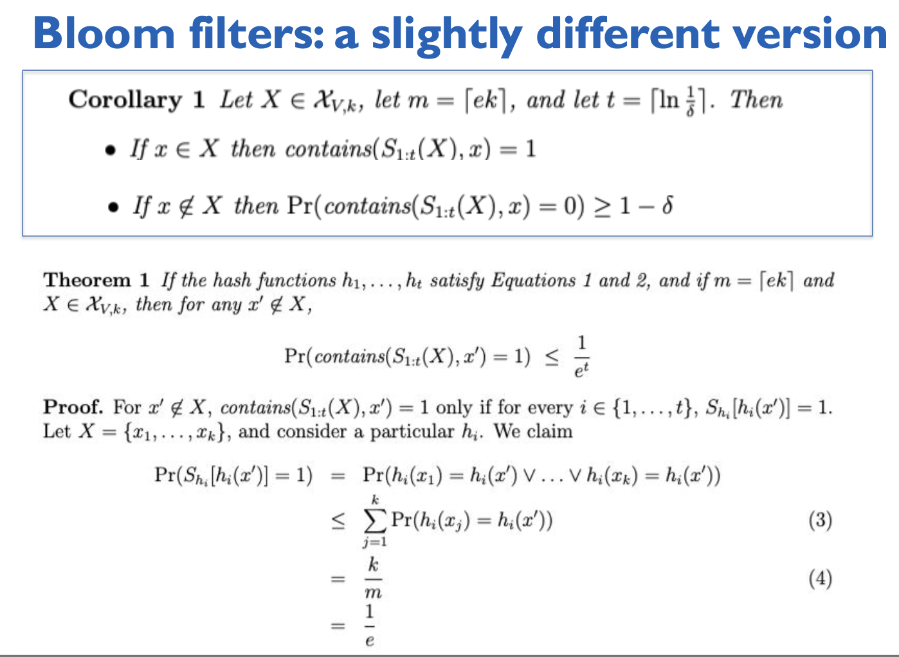
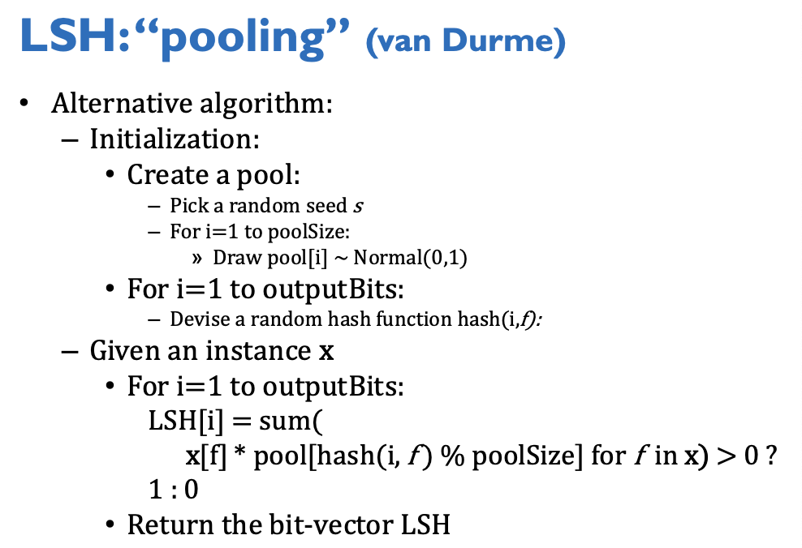
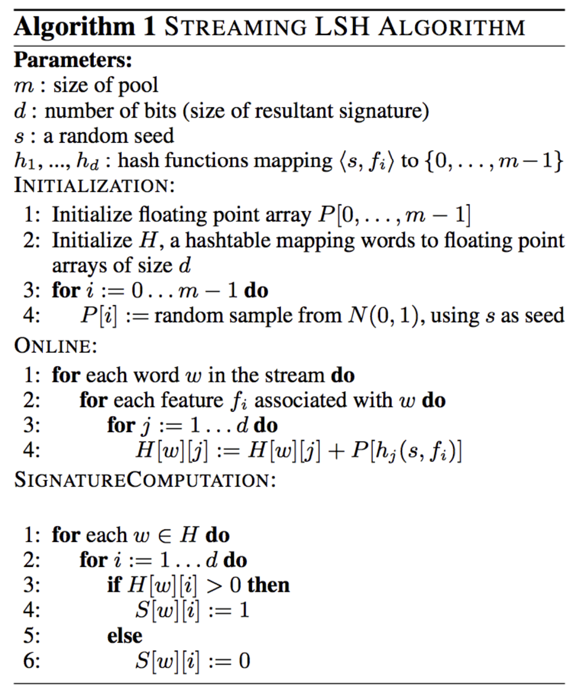
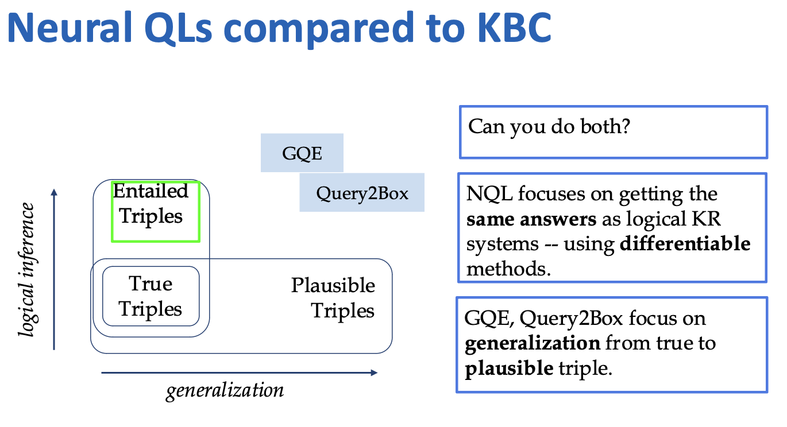

### Scaling Laws

### Cost of operations

### Naive Estimate of Joint Probability
- Assumes independence conditionally $P(c,x) = P(x|c) P(c)$
- Smooth the estimates 
- Classification vs Density Estimation

### Tasks
- Linear-time tasks
  - small things sequentially 
    ```
    map(lambda x:x*2, range(0,20,4))
    ```
- Parallel Tasks
  - Mappers independent
  - faster but a lot cannot do (sequentials)
  - Sorting operations O(n logn)

### Entity Resolution
- Small vocab Counting: lots of memory 
- Large Vocab word count with sorting
  - Streaming -> sort (shuffle sort) -> streaming


### MapReduce
- Work distribution of reducer 
- BashReduce
- Failure handling:
- Debugging
  - careful about shared information
- Abstractions for MapReduce
  - each row 
  - table: 
    - proposed syntax: group by ...
    - join
### Spark
- Data abstraction
  - RDD (resilient distributioned datasets)
    - immutable, can be marked as persistant [.persist()], partitioned and shared, access with short MapReduce pipelines
    - memory cached RDDs [.cache()]
      - if not cache, need to reload the data
  - Operations: 
    - Transformations: lazy
      - Transformations are like 'code
      - recovery from errors, data is stored multiple copies with how they were created; if break, can restore
      - some transformations are cheap mapper process: partitions are the same 
      - some require expensive shuflfe sort: join, groupby
    - Actions: eager, execute and return object
      - use spark interactively; when debug; bottlenecks for production
  
- Logistic Regression example:
  - gradient code: python builds a closure, read-only value
  - gradient done locally on each worker

- Communicate w/o RDDs
  - Broadcast variables
    - e.g. join forces shuffle sort, but if one dataset is much smaller, broadcast this set as variable
  - accumulators: shared counters; don't know the order of increments
  - closures: pass as 

### MapReduce History
- Ken Church
- Unix sort (mergesort, parallelized, cached): fixed memory
- Counter object:
  - stream all words
  - flush when: (1) new word (2) max buffer
- Stream sort and parallelize
  - sort by partition data appropriately: hash sort key


### Compare words in two corpus
- count words
- bigram
  - (pxy / (px * py))
- pipeline - basic count
- filtering


### Page Rank
- Inlinks
- page hopper: follow random link or jump to random page
- ranks page based on the time page hopper spends
- expect crowd size
- p60

### MLE


### Parallel SGD
- option 1: larger batches
- option 2: multiple SGD prcesses in parallel and synchronize occasionally
  - better suit cluster level parallelism
  - harder to analyze and few formal proofs
- parallelizng k-means
  - split points to workers
  - workers assign points to closest cluster - E-step
    - Keep track of weights of centroid
  - reduce: weighted average - M-step
  - repeat for mappers
  - traditional: every iteration data is read and model is written


### Kernel Methods (feature extraction)
- What is kernel method: 
  - 
- Purpose of Applying kernel tricks: 


- Gram matrix: kernel similarity between the training example
- [Kernel Ridge Regression](https://web2.qatar.cmu.edu/~gdicaro/10315-Fall19/additional/welling-notes-on-kernel-ridge.pdf)
- Hash Kernel
  - The transformation of x to kernel(x) might make the new feature shorter nd less sparse
  - not approriate for dense data, strongly dependencies between params, distributed systems


### Hash Kernel


### Sparse parameters


### Distributed Optimization 
- Data parallelism: workers get part of data and copues of the model
  - min sync 1: p different logistic regression from shards with Batched Gradient descent (majority vote or avg to combine)
  - min sync 2: p classifiers from T examples SGD - avg to combine
  - HogWild!: multi SGD on multicore CPU shared memory 
    - no locking when update, fast learner
    - The key insight behind HogWild! is that for sparse datasets, conflicts (overwrites) are rare, so skipping locks leads to significant speedups with little accuracy loss.
    - 
  - intermediate sync: split data to S shards for perceptrons - parallel perceptron 
    - not always work 
    - perceptron gauraanteed to converge
    - extra communication cosee from weight distribution
    - iteractive parameyer mixing also guarantee to converge
    - not to converge faster
  - How to sync 
    - All reduce 
      - Tree AllReduce
        - workers execute same code, allreduce calls
        - workers block and sync when allreduce
        - server tells where to transmit information 
        - from bottom to top
        - all reduce ends when all workers sync and go back to work
        - Pro:
          - minimize links and amount of data transmitted
          - reduce bottlenecks to single driver machine
          - convenient architecture
            - independent learning processes
            - for Hadoop reduces overhead for mid scale jobs
        -  Con:
           -  no redundancy potentially fragile
           -  failure at any point would break the process bc of the hierarichy
      -  Ring All Reduce 
         -  send smaller messages in parallel
         -  high bandwidth connections
         -  with m= ring cycle, k=size of param evctor
            -  2(m-1) rounds of communication 
            -  k/m communicated
         -  
   -  Parameter Server
      -  push and pull interface to send and receive most recent copy of parameters, optional blocking
      -  different parts of model on different servers
      -  worker retieve the part needed
      -  It's like remote git
      -  Pro:
         -  convenient, powerful when parameters sparse and vectors can b sharded across PS machines
      -  Con:
         -  prone to bottlneck - frequent hits (saving the most frequent params on the same PS)


### Distributed SGD  

-  Matrix Factorization
   -  find latent variables
   -  V = WH
   -  some steps are independent
   -  pick diagonal blocks
-  k-means clustering
   -  EM algorithm
      -  E-step: map each data with closest centroid (expected values of cluster assignment)
      -  M-step: recalculate centroids as average of data mapped (get new centroids maximizing expectation)
   -  MapReduce
      -  Mappers: read data and centroids, assign data to clusters, compute new local centroids
      -  Reducers: aggregate local centroids to new glocal centroids, write and distribute new centroids
      -  


### Random algorithm 
- Bloom Filter (like a set data structure)
  - Many hash functions
  - if s in set, return true
  - else probability at least 1-p return false and at most p return true
  - allocate M bits (buckets)
  - K hash functions
  - Add(s): set bit[hash(i,s)]=1
  - Contains(s): 
    - for i=1 to k, test bit[hash(i,s)]
    - Return “true” if they’re all set; otherwise, return “false”
  - M = 1.5*maxSize
  - K = 2*log(1/p)
  - Pr(collision) = Pr(all k bits set) = $(1- [1-1/m]^k) \approx (1-e^{-kn/m})^k$
    - fix m and n to find $argmin_k f(m,n,k)$, k = m/n ln2 about 0.7m/n
    - plug k back to Pr(collision)
    - solve for 3rd by fixing any two: m = -(n lnp)/(ln2)^2
  - [Proof of upper bound for collision](https://www.cs.cmu.edu/~wcohen/10-605/notes/randomized-algs.pdf)
    - 
  - usage:
    - find items in sharded data (okay to have small false positive, O(1) extra shards if p=1/#shards)
    - discard singleton feature from classifier
      - scan through data, use 2 bfs, add to bf2 if bf1 contains, else add to bf1. 
      - basically the count of words
      - ignore words not in bf2
- Count Min Sketch
  - t(#hash functions) rows m(#bits) columns
  - increment count
  - return the min of the count 
  - only overcounting when collision
  - initialization:
    - m=$\frac{e}{\epsilon}$ 
    - t=$ln(1\delta)$
  - Same corollary with bloom filter, with false positive rate as delta 
  - Notations for math part:
    - k: number of distinct values of x 
    - t: number of hash functions
    - $\delta$: confidence level
    - a[x]: actual count of x
    - $\epsilon$: error rate
  - Error bounded:
    - for m (number of buckets) =ek, t (number of hashes)=$ln\frac{1}{\delta}$
      - all $x\in V$, retrive(x)$\ge$a[x], always over count
      - all $x\in V$, probability of retrieval $\ne$ a[x] $\le 1-\delta$
    - for m= $\frac{e}{\epsilon}$
      - all $x\in V$, probability of retrival $\ne$ a[x] + $\epsilon ||a||_1$ $\le 1-\delta$
      - Pr((excess in r[h(x)] due to collisions with other x’) > 𝜺 ||a||1) < 1/e
  - Guarantees:
    - approximation error on point queries less than 𝜺||A||1 in space O(1/𝜺 log 1/𝛿)
    - also accurate for skewed values---i.e., only a few entries s with large A[s]
  - Markov inequality
    - c Pr(X>=c) <= E[X]
  - Application: sentiment analysis: positive words appear with positive words with higher probability
  - 

### LSH local sensitivity hashing
- random projections $\frac{ab}{||a||\cdot||b||} = cos\theta$
- basic idea: if points are similar, projection is close
- Algorithm:
  - repeat: pick random hyperplane; calculate $r\cdot x$; record if inner product >=0 close to each other; x' and x small cosine distance then bx and bx' have small hamming distance
  - result: $cos(\theta)\approx (h/b\pi)$, with h as diff, b as signature length
- Applications:
  - compact storage of data
  - fast approximations
  - fast clustering
- Extension: pooling
  - problem: storing classifiers is expensive, storing seeds is fragile
  - solution, just store the pool:  
- Extension: online setting
  - problem: distributional clustering
  - v(w): vector of words co-occur with word w, we want to cluster v(w), construct LSH(v(w)) for every word in the corpus
  - stream through the corpus once
  - 
  - Tricks:
    - save calls to random with pooling
    - compute word distribution vector incrementtally
    - thresholding random projections to a bit
- Applications:
  - compress a set of vectors
  - index a set of vectors
    - approximate k-NN search maps query vector to k most similar vectors
  - Find closest bit vector in a collection for q
    - 2^k buckets of distance k
    - multi-index hashing: break into m equal-size bitstrings, if hamming(h,g)< r, then for some z hamming(h(z),g(z))< r/m
  - K-means: find element x closest to qx to cluster qx
  - J-means: 
    - find centroid i closest to qx: O(J) distance computations
    - find x in cluster i closest to qx: O(N/J) computation
    - J = sqrt(N) : O(J)+O(N/J) beats O(N)
    - tree of depth d: O(dJ) * O(N/J^d)
  - Vector quantization
    - find approx k-NN to qx
    - map qx to similar centroid
    - compression
    - product quantization
### AutoDiff
- Wengirt list


### emQL, NQL
- NQL
  - network of differentiable functions
  - set of relations QA
  - sparse localust representation, lots of predictions
- EmQL
  - Knowledged completion: ex. co-authors
  - area in the enbedding/latent space
  - 
  - embedding requires fewer predictions
  - centroid sketch sets
    - max set size known, elements in the set are reasonably similar
    - X -> (ax, bx)
    - 
- Compare: 
  - NQL vs EmQL
    - more vs fewer predictions
    - embeddings require few predictions and generalize well but dont memorize details of relationship
  - 
### Parallel with GPU 
- GPU: mistly single instruction multiple data
- more cores less memory (on-chip memory), read memory faster
- TPU designed for ML
- Device code: mykernel<<<1,1>>>: kernel launch 
- Device pointers point to GPU memory
- Host pointers point to CPU memory 
- NPU
  - grid / mesh: connect neighbor hardware with high-bandwith
  - torus: connect between levels
- Memory hierarchy: slow to fast
  - fetching/storing on CPU
  - High bandwidth memory
  - sparsecore memory
  - glocal memory SRAM, typically where models are
  - thread-local memory, caches, registers
  - 
- non-convexity
- model parallel
  - intra-layer: units in one layer partitioned
  - inter-layer: layers are partitioned
    - wait for inputs?
  - combined: 
    - distributed data parallel
    - fully sharded data parallel (model cannot fit on one GPU)
    - tensor parallel, pipeline parallel
  - Synchronization
    - Async ML: sparse updates, no overlap, low bandwidth, hogwild
    - Ring Allreduce
- Batch size
  - large batches, better compute time, less communication, but lead to sharp local minima, not generalize well
    - diminishing returns with larger batches for speed up
  - Small batches, result better, diverse updates
- Fine-tuning
  - specification: small subset of params and tune those
  - addition: additional trainable params
  - reparameterize
  - linear probing: update porion of the weights, change last layer of classification
  - adapters: between layers of the network, still need forward pass
  - LoRA: low rank approximation
    - $W_{ft} = W_{pt}+\frac{\alpha}{r} AB$ with $\alpha$ scaling factor, AB rank decomposition
    - QLoRA: quantize pretrained weights so they are smal 
  - Modern optimizers
    - Newton method: Hessian matrix O(n^2)
    - AdaGrad: cheap approy of hessian, only diagonal elements, step size can be very small
    - RMSProp: moving avg of coorfinates of gradient, incread of sum
    - Momentum: if change in the same direction, move faster, proportional with last update
    - Nesterov accelerated gradient: look ahead point
    - Adam: combine everything
    - early stopping


### Deep learning
- ANN
- vanishing gradient
- sigmoid saturation
- CNN


### Hyperparameter Tuning


### Parallelism
#### Data parallelism
#### Model parallelism 
#### Pipeline parallelism 


### Distillation


### Model Pruning


### Quantization


### KV-Caching


### RAG


### Embarassingly Parallel Train

#### Mixture of Experts
